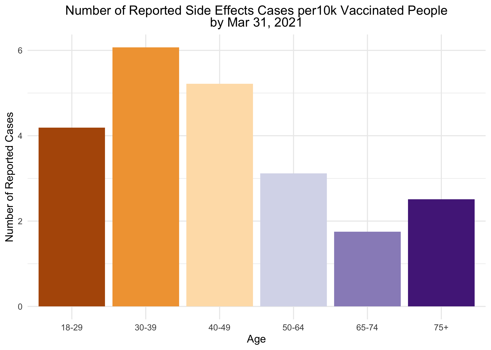
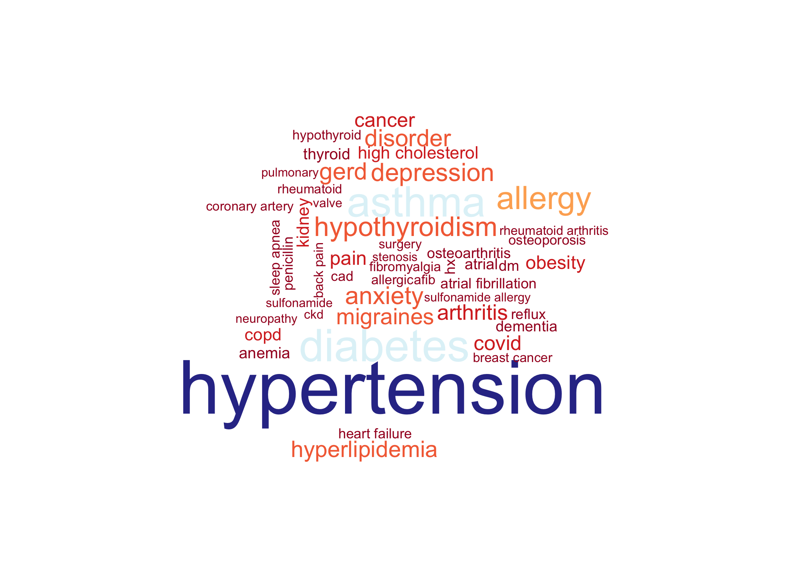
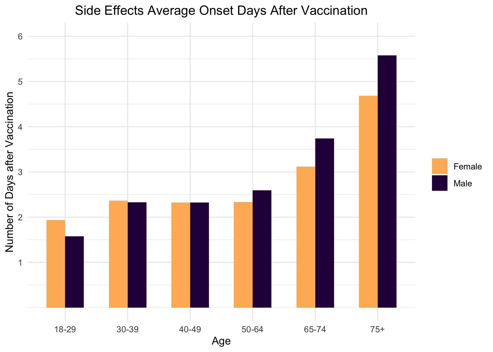
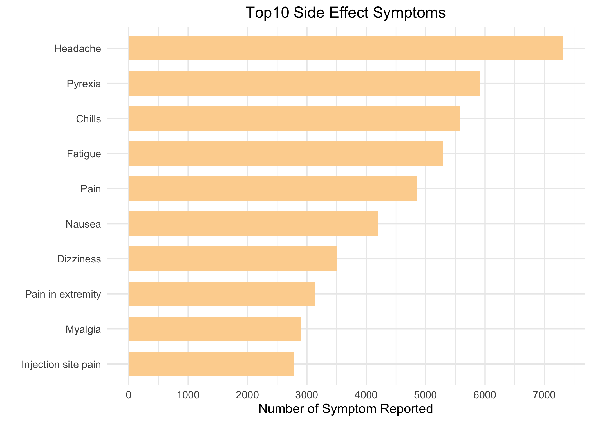

```r
packages <- c("devtools","knitr","tidyverse","widgetframe","readr",
              "wordcloud", "base64enc", "tidytext", 
              "RWeka","stats","manifestoR","readtext",
              "rvest", "stringr", 
              "SnowballC", "plotrix", "tidyr", "tidytext", "stats", 
              "dendextend", "ggthemes",
              "httr","jsonlite", "DT", "textdata", "ggmap","maptools","mapproj","rgeos","rgdal",
              "RColorBrewer", "stringr","scales", "leaflet", 'leafpop', "ggthemes", "ggtext", "wordcloud")

packages <- lapply(packages, FUN = function(x) {
  if(!require(x, character.only = TRUE)) {
    install.packages(x)
  library(x, character.only = TRUE)
  }
}
)
```

# Overview

For this project, we explored reported side effects of the covid-19 vaccine, focusing on adverse reactions reported from 2020-12-01 to   2021-3-31. The visualization aims to provide an insight into who are the people reporting side effects and how do they compare to the general population; the most common reported symptoms etc. We also analyzed tweets associated with the covid-19 vaccine to see people's attitudes on the vaccine.

# Data

- Vaccine Adverse Event Reporting System (VAERS)1 established by the Food and Drug Administration (FDA) and the Centers for Disease Control and Prevention (CDC) 
https://vaers.hhs.gov/data/datasets.html?
- Allocations of Covid-19 vaccines produced by Pfizer and Moderna into different States by CDC https://data.cdc.gov/Vaccinations/COVID-19-Vaccine-Distribution-Allocations- by-Juris/saz5-9hgg https://data.cdc.gov/Vaccinations/COVID-19-Vaccine-Distribution-Allocations- by-Juris/b7pe-5nws
- COVID-19 Vaccination Demographic Data. Vaccination by age. https://www.cdc.gov/coronavirus/2019-ncov/vaccines/distributing/demographics-vaccination-data.html
- State-by-state data on COVID-19 vaccinations in the United States 
https://ourworldindata.org/us-states-vaccinations
- All COVID-19 Vaccines Tweets
https://www.kaggle.com/gpreda/all-covid19-vaccines-tweets


# Who Are the People Reporting Side Effects ? 

## Age and Gender

### Do elders suffer more from side effects ? Not exactly


```r
vac <- read_csv("part1data/2021VAERSDATA.csv")
sym <- read_csv("part1data/2021VAERSSYMPTOMS.csv")
vax <- read_csv("part1data/2021VAERSVAX.csv")

#convert vaccination date
vac$VAX_DATE <- as.Date(vac$VAX_DATE, format = "%m/%d/%Y") 

#merge the first two csv file by patient ID
merge1 <- left_join(vac, sym, by = "VAERS_ID")
#merge the third csv together
merge <- left_join(merge1, vax, by = "VAERS_ID")

#filter for COVID19 vaccine
covid <- merge %>% 
  filter(VAX_TYPE == "COVID19")

#find out patient's age and gender
agesex <- covid %>% 
  distinct(VAERS_ID,.keep_all = TRUE) %>% #distinct patients
  select(AGE_YRS, SEX, VAX_DATE) %>% 
  filter(AGE_YRS >= 18 & AGE_YRS != 'NA', VAX_DATE >= "2020-12-01" & SEX != "U" ) #filter for age over 18, vaccination data after 2020-12-01 and filter out unknown value for sex

as <- agesex %>% 
  group_by(SEX,AGE_YRS) %>% 
  count(SEX,AGE_YRS)
as
```

```
## # A tibble: 176 x 3
## # Groups:   SEX, AGE_YRS [176]
##    SEX   AGE_YRS     n
##    <chr>   <dbl> <int>
##  1 F          18    31
##  2 F          19    74
##  3 F          20    92
##  4 F          21   115
##  5 F          22   169
##  6 F          23   190
##  7 F          24   231
##  8 F          25   316
##  9 F          26   321
## 10 F          27   339
## # … with 166 more rows
```

```r
ggplot(as, aes(x = AGE_YRS, y = n, color = SEX))+
  geom_line(size = 1)+ 
  labs(title = "Covid Vaccine Side Effects Reported Based on Age and Sex<br> By Mar 31, 2021",x="Age",y = "Number of People Reported") + 
  scale_x_continuous(breaks = seq(20,110,10), limits = c(15, 110)) + scale_y_continuous(breaks = seq(0,600,200), limits = c(0, 600))+
  theme_minimal()  + theme(plot.title = element_markdown(hjust = 0.5),legend.title = element_blank()) + scale_color_manual(values = c("#fdb863","#2d004b"),labels = c("Female", "Male"))
```


We could see that in general, women and younger people seem to suffer more from side effects. As age increased, the report number actually decreased, especially for women. Do elders suffer more from side effects? Not exactly.
Is it possible there are fewer elders who got vaccinated thus fewer reports? We decided to dive deeper into who got vaccinated by looking at different age groups. 

### Vaccinated rate by different age group


```r
#vaccinated number by age group from cdc
agegroup <- read_csv("part1data/demographic_trends_of_people_receiving_covid19_vaccinations_in_the_united_states.csv")
agegroup$Date <- as.Date(agegroup$Date, format = "%Y/%m/%d") 
ageg <- agegroup %>% 
  filter(Date <= "2021-03-31") %>% #filter for date before 2021/03/31
  filter(`Age Group` != "Age_unknown" & `Age Group` != "Age_known" & `Age Group` != "Ages_<18yrs") %>%  #filter for age > 18
  select(Date, `Age Group`, `People with at least one dose`, `Percent of age group with at least one dose`, Census)

ageg$Age <- with(ageg, ifelse(`Age Group` == "Ages_18-29_yrs", "18-29",
                              ifelse(`Age Group` == "Ages_30-39_yrs", "30-39",
                                            ifelse(`Age Group` == "Ages_40-49_yrs", "40-49",
                                                   ifelse(`Age Group` == "Ages_50-64_yrs", "50-64",
                                                          ifelse(`Age Group` == "Ages_65-74_yrs", "65-74",
                                                                 ifelse(`Age Group` == "Ages_75+_yrs", "75+", "other")))))))
ageg
```

```
## # A tibble: 636 x 6
##    Date       `Age Group`  `People with at le… `Percent of age gro… Census Age  
##    <date>     <chr>                      <dbl>                <dbl>  <dbl> <chr>
##  1 2021-03-31 Ages_75+_yrs            15827616                 74.1 2.14e7 75+  
##  2 2021-03-30 Ages_75+_yrs            15755182                 73.8 2.14e7 75+  
##  3 2021-03-29 Ages_75+_yrs            15717469                 73.6 2.14e7 75+  
##  4 2021-03-28 Ages_75+_yrs            15663561                 73.4 2.14e7 75+  
##  5 2021-03-27 Ages_75+_yrs            15575262                 72.9 2.14e7 75+  
##  6 2021-03-26 Ages_75+_yrs            15462377                 72.4 2.14e7 75+  
##  7 2021-03-25 Ages_75+_yrs            15336407                 71.8 2.14e7 75+  
##  8 2021-03-24 Ages_75+_yrs            15231705                 71.3 2.14e7 75+  
##  9 2021-03-23 Ages_75+_yrs            15131315                 70.9 2.14e7 75+  
## 10 2021-03-22 Ages_75+_yrs            15049439                 70.5 2.14e7 75+  
## # … with 626 more rows
```

```r
 g <-  ggplot() + geom_line(data = ageg, aes(x = Date, y =`Percent of age group with at least one dose`, color = Age))+ scale_color_brewer(palette = "PuOr") +scale_y_continuous(breaks = seq(0,100,25), limits = c(0,100))+labs(title = "Percentage of People that Have Received at Least One Dose of Cov Vaccine<br>by Age Group", subtitle = "2020/12/16 - 2021/3/31",x="",y = "") +  theme_minimal() + theme(plot.title = element_markdown(hjust=0.5)) + theme(legend.position = "top", legend.title = element_text(size = 8)) +  theme(plot.subtitle=element_text(hjust=0.5))  + scale_y_continuous(labels = c("0" = "0", "25" = "25%", "50" = "50%", "75" = "75%", "100" = "100%")) + guides(colour = guide_legend(nrow = 1)) 
  #, labels = c("18-29",  "30-39",  "40-49", "50-64",  "65-74", "75+"

library(plotly)
ggplotly(g) %>% layout(title = paste0("Vaccinated Rate by Different Age Group", "<br>","2020/12/16- 2021/3/31"))
```

```{=html}
<div id="htmlwidget-26d931a69a1e97b7d469" style="width:70%;height:70%;" class="plotly html-widget"></div>
<script type="application/json" data-for="htmlwidget-26d931a69a1e97b7d469">{"x":{"data":[{"x":[18612,18613,18614,18615,18616,18617,18618,18619,18620,18621,18622,18623,18624,18625,18626,18627,18628,18629,18630,18631,18632,18633,18634,18635,18636,18637,18638,18639,18640,18641,18642,18643,18644,18645,18646,18647,18648,18649,18650,18651,18652,18653,18654,18655,18656,18657,18658,18659,18660,18661,18662,18663,18664,18665,18666,18667,18668,18669,18670,18671,18672,18673,18674,18675,18676,18677,18678,18679,18680,18681,18682,18683,18684,18685,18686,18687,18688,18689,18690,18691,18692,18693,18694,18695,18696,18697,18698,18699,18700,18701,18702,18703,18704,18705,18706,18707,18708,18709,18710,18711,18712,18713,18714,18715,18716,18717],"y":[0,0,0,0.1,0.1,0.2,0.2,0.3,0.4,0.5,0.5,0.5,0.6,0.6,0.7,0.8,0.9,1,1.1,1.1,1.1,1.2,1.4,1.5,1.7,1.8,1.9,2,2.1,2.2,2.4,2.6,2.7,2.8,2.9,3,3.1,3.3,3.4,3.6,3.7,3.7,3.8,3.9,4.1,4.2,4.3,4.4,4.5,4.5,4.6,4.7,4.8,4.9,5,5.1,5.2,5.3,5.4,5.5,5.6,5.7,5.7,5.8,5.9,6,6.1,6.1,6.2,6.3,6.3,6.4,6.5,6.7,6.8,6.9,7.1,7.2,7.3,7.5,7.7,7.9,8.1,8.3,8.4,8.7,8.9,9.3,9.6,9.9,10.1,10.4,10.7,11,11.5,11.9,12.2,12.5,12.9,13.3,13.8,14.3,14.8,15.2,15.4,15.8],"text":["Date: 2020-12-16<br />Percent of age group with at least one dose:  0.0<br />Age: 18-29","Date: 2020-12-17<br />Percent of age group with at least one dose:  0.0<br />Age: 18-29","Date: 2020-12-18<br />Percent of age group with at least one dose:  0.0<br />Age: 18-29","Date: 2020-12-19<br />Percent of age group with at least one dose:  0.1<br />Age: 18-29","Date: 2020-12-20<br />Percent of age group with at least one dose:  0.1<br />Age: 18-29","Date: 2020-12-21<br />Percent of age group with at least one dose:  0.2<br />Age: 18-29","Date: 2020-12-22<br />Percent of age group with at least one dose:  0.2<br />Age: 18-29","Date: 2020-12-23<br />Percent of age group with at least one dose:  0.3<br />Age: 18-29","Date: 2020-12-24<br />Percent of age group with at least one dose:  0.4<br />Age: 18-29","Date: 2020-12-25<br />Percent of age group with at least one dose:  0.5<br />Age: 18-29","Date: 2020-12-26<br />Percent of age group with at least one dose:  0.5<br />Age: 18-29","Date: 2020-12-27<br />Percent of age group with at least one dose:  0.5<br />Age: 18-29","Date: 2020-12-28<br />Percent of age group with at least one dose:  0.6<br />Age: 18-29","Date: 2020-12-29<br />Percent of age group with at least one dose:  0.6<br />Age: 18-29","Date: 2020-12-30<br />Percent of age group with at least one dose:  0.7<br />Age: 18-29","Date: 2020-12-31<br />Percent of age group with at least one dose:  0.8<br />Age: 18-29","Date: 2021-01-01<br />Percent of age group with at least one dose:  0.9<br />Age: 18-29","Date: 2021-01-02<br />Percent of age group with at least one dose:  1.0<br />Age: 18-29","Date: 2021-01-03<br />Percent of age group with at least one dose:  1.1<br />Age: 18-29","Date: 2021-01-04<br />Percent of age group with at least one dose:  1.1<br />Age: 18-29","Date: 2021-01-05<br />Percent of age group with at least one dose:  1.1<br />Age: 18-29","Date: 2021-01-06<br />Percent of age group with at least one dose:  1.2<br />Age: 18-29","Date: 2021-01-07<br />Percent of age group with at least one dose:  1.4<br />Age: 18-29","Date: 2021-01-08<br />Percent of age group with at least one dose:  1.5<br />Age: 18-29","Date: 2021-01-09<br />Percent of age group with at least one dose:  1.7<br />Age: 18-29","Date: 2021-01-10<br />Percent of age group with at least one dose:  1.8<br />Age: 18-29","Date: 2021-01-11<br />Percent of age group with at least one dose:  1.9<br />Age: 18-29","Date: 2021-01-12<br />Percent of age group with at least one dose:  2.0<br />Age: 18-29","Date: 2021-01-13<br />Percent of age group with at least one dose:  2.1<br />Age: 18-29","Date: 2021-01-14<br />Percent of age group with at least one dose:  2.2<br />Age: 18-29","Date: 2021-01-15<br />Percent of age group with at least one dose:  2.4<br />Age: 18-29","Date: 2021-01-16<br />Percent of age group with at least one dose:  2.6<br />Age: 18-29","Date: 2021-01-17<br />Percent of age group with at least one dose:  2.7<br />Age: 18-29","Date: 2021-01-18<br />Percent of age group with at least one dose:  2.8<br />Age: 18-29","Date: 2021-01-19<br />Percent of age group with at least one dose:  2.9<br />Age: 18-29","Date: 2021-01-20<br />Percent of age group with at least one dose:  3.0<br />Age: 18-29","Date: 2021-01-21<br />Percent of age group with at least one dose:  3.1<br />Age: 18-29","Date: 2021-01-22<br />Percent of age group with at least one dose:  3.3<br />Age: 18-29","Date: 2021-01-23<br />Percent of age group with at least one dose:  3.4<br />Age: 18-29","Date: 2021-01-24<br />Percent of age group with at least one dose:  3.6<br />Age: 18-29","Date: 2021-01-25<br />Percent of age group with at least one dose:  3.7<br />Age: 18-29","Date: 2021-01-26<br />Percent of age group with at least one dose:  3.7<br />Age: 18-29","Date: 2021-01-27<br />Percent of age group with at least one dose:  3.8<br />Age: 18-29","Date: 2021-01-28<br />Percent of age group with at least one dose:  3.9<br />Age: 18-29","Date: 2021-01-29<br />Percent of age group with at least one dose:  4.1<br />Age: 18-29","Date: 2021-01-30<br />Percent of age group with at least one dose:  4.2<br />Age: 18-29","Date: 2021-01-31<br />Percent of age group with at least one dose:  4.3<br />Age: 18-29","Date: 2021-02-01<br />Percent of age group with at least one dose:  4.4<br />Age: 18-29","Date: 2021-02-02<br />Percent of age group with at least one dose:  4.5<br />Age: 18-29","Date: 2021-02-03<br />Percent of age group with at least one dose:  4.5<br />Age: 18-29","Date: 2021-02-04<br />Percent of age group with at least one dose:  4.6<br />Age: 18-29","Date: 2021-02-05<br />Percent of age group with at least one dose:  4.7<br />Age: 18-29","Date: 2021-02-06<br />Percent of age group with at least one dose:  4.8<br />Age: 18-29","Date: 2021-02-07<br />Percent of age group with at least one dose:  4.9<br />Age: 18-29","Date: 2021-02-08<br />Percent of age group with at least one dose:  5.0<br />Age: 18-29","Date: 2021-02-09<br />Percent of age group with at least one dose:  5.1<br />Age: 18-29","Date: 2021-02-10<br />Percent of age group with at least one dose:  5.2<br />Age: 18-29","Date: 2021-02-11<br />Percent of age group with at least one dose:  5.3<br />Age: 18-29","Date: 2021-02-12<br />Percent of age group with at least one dose:  5.4<br />Age: 18-29","Date: 2021-02-13<br />Percent of age group with at least one dose:  5.5<br />Age: 18-29","Date: 2021-02-14<br />Percent of age group with at least one dose:  5.6<br />Age: 18-29","Date: 2021-02-15<br />Percent of age group with at least one dose:  5.7<br />Age: 18-29","Date: 2021-02-16<br />Percent of age group with at least one dose:  5.7<br />Age: 18-29","Date: 2021-02-17<br />Percent of age group with at least one dose:  5.8<br />Age: 18-29","Date: 2021-02-18<br />Percent of age group with at least one dose:  5.9<br />Age: 18-29","Date: 2021-02-19<br />Percent of age group with at least one dose:  6.0<br />Age: 18-29","Date: 2021-02-20<br />Percent of age group with at least one dose:  6.1<br />Age: 18-29","Date: 2021-02-21<br />Percent of age group with at least one dose:  6.1<br />Age: 18-29","Date: 2021-02-22<br />Percent of age group with at least one dose:  6.2<br />Age: 18-29","Date: 2021-02-23<br />Percent of age group with at least one dose:  6.3<br />Age: 18-29","Date: 2021-02-24<br />Percent of age group with at least one dose:  6.3<br />Age: 18-29","Date: 2021-02-25<br />Percent of age group with at least one dose:  6.4<br />Age: 18-29","Date: 2021-02-26<br />Percent of age group with at least one dose:  6.5<br />Age: 18-29","Date: 2021-02-27<br />Percent of age group with at least one dose:  6.7<br />Age: 18-29","Date: 2021-02-28<br />Percent of age group with at least one dose:  6.8<br />Age: 18-29","Date: 2021-03-01<br />Percent of age group with at least one dose:  6.9<br />Age: 18-29","Date: 2021-03-02<br />Percent of age group with at least one dose:  7.1<br />Age: 18-29","Date: 2021-03-03<br />Percent of age group with at least one dose:  7.2<br />Age: 18-29","Date: 2021-03-04<br />Percent of age group with at least one dose:  7.3<br />Age: 18-29","Date: 2021-03-05<br />Percent of age group with at least one dose:  7.5<br />Age: 18-29","Date: 2021-03-06<br />Percent of age group with at least one dose:  7.7<br />Age: 18-29","Date: 2021-03-07<br />Percent of age group with at least one dose:  7.9<br />Age: 18-29","Date: 2021-03-08<br />Percent of age group with at least one dose:  8.1<br />Age: 18-29","Date: 2021-03-09<br />Percent of age group with at least one dose:  8.3<br />Age: 18-29","Date: 2021-03-10<br />Percent of age group with at least one dose:  8.4<br />Age: 18-29","Date: 2021-03-11<br />Percent of age group with at least one dose:  8.7<br />Age: 18-29","Date: 2021-03-12<br />Percent of age group with at least one dose:  8.9<br />Age: 18-29","Date: 2021-03-13<br />Percent of age group with at least one dose:  9.3<br />Age: 18-29","Date: 2021-03-14<br />Percent of age group with at least one dose:  9.6<br />Age: 18-29","Date: 2021-03-15<br />Percent of age group with at least one dose:  9.9<br />Age: 18-29","Date: 2021-03-16<br />Percent of age group with at least one dose: 10.1<br />Age: 18-29","Date: 2021-03-17<br />Percent of age group with at least one dose: 10.4<br />Age: 18-29","Date: 2021-03-18<br />Percent of age group with at least one dose: 10.7<br />Age: 18-29","Date: 2021-03-19<br />Percent of age group with at least one dose: 11.0<br />Age: 18-29","Date: 2021-03-20<br />Percent of age group with at least one dose: 11.5<br />Age: 18-29","Date: 2021-03-21<br />Percent of age group with at least one dose: 11.9<br />Age: 18-29","Date: 2021-03-22<br />Percent of age group with at least one dose: 12.2<br />Age: 18-29","Date: 2021-03-23<br />Percent of age group with at least one dose: 12.5<br />Age: 18-29","Date: 2021-03-24<br />Percent of age group with at least one dose: 12.9<br />Age: 18-29","Date: 2021-03-25<br />Percent of age group with at least one dose: 13.3<br />Age: 18-29","Date: 2021-03-26<br />Percent of age group with at least one dose: 13.8<br />Age: 18-29","Date: 2021-03-27<br />Percent of age group with at least one dose: 14.3<br />Age: 18-29","Date: 2021-03-28<br />Percent of age group with at least one dose: 14.8<br />Age: 18-29","Date: 2021-03-29<br />Percent of age group with at least one dose: 15.2<br />Age: 18-29","Date: 2021-03-30<br />Percent of age group with at least one dose: 15.4<br />Age: 18-29","Date: 2021-03-31<br />Percent of age group with at least one dose: 15.8<br />Age: 18-29"],"type":"scatter","mode":"lines","line":{"width":1.88976377952756,"color":"rgba(179,88,6,1)","dash":"solid"},"hoveron":"points","name":"18-29","legendgroup":"18-29","showlegend":true,"xaxis":"x","yaxis":"y","hoverinfo":"text","frame":null},{"x":[18612,18613,18614,18615,18616,18617,18618,18619,18620,18621,18622,18623,18624,18625,18626,18627,18628,18629,18630,18631,18632,18633,18634,18635,18636,18637,18638,18639,18640,18641,18642,18643,18644,18645,18646,18647,18648,18649,18650,18651,18652,18653,18654,18655,18656,18657,18658,18659,18660,18661,18662,18663,18664,18665,18666,18667,18668,18669,18670,18671,18672,18673,18674,18675,18676,18677,18678,18679,18680,18681,18682,18683,18684,18685,18686,18687,18688,18689,18690,18691,18692,18693,18694,18695,18696,18697,18698,18699,18700,18701,18702,18703,18704,18705,18706,18707,18708,18709,18710,18711,18712,18713,18714,18715,18716,18717],"y":[0,0,0,0.1,0.3,0.4,0.4,0.6,0.8,1,1.1,1.1,1.2,1.2,1.4,1.7,1.9,2.1,2.1,2.2,2.3,2.4,2.7,2.9,3.2,3.4,3.5,3.6,3.8,4,4.3,4.6,4.8,5,5.1,5.2,5.4,5.6,5.8,6.1,6.2,6.4,6.5,6.7,6.9,7.1,7.3,7.4,7.5,7.5,7.7,7.8,8,8.2,8.3,8.4,8.6,8.7,8.8,9,9.2,9.3,9.4,9.5,9.6,9.8,9.9,10.1,10.2,10.2,10.3,10.5,10.7,10.9,11.1,11.3,11.5,11.7,11.9,12.2,12.5,12.9,13.1,13.4,13.7,14,14.5,15,15.5,15.8,16.1,16.6,17.1,17.5,18.1,18.8,19.2,19.6,20.1,20.6,21.3,22,22.7,23.2,23.5,24],"text":["Date: 2020-12-16<br />Percent of age group with at least one dose:  0.0<br />Age: 30-39","Date: 2020-12-17<br />Percent of age group with at least one dose:  0.0<br />Age: 30-39","Date: 2020-12-18<br />Percent of age group with at least one dose:  0.0<br />Age: 30-39","Date: 2020-12-19<br />Percent of age group with at least one dose:  0.1<br />Age: 30-39","Date: 2020-12-20<br />Percent of age group with at least one dose:  0.3<br />Age: 30-39","Date: 2020-12-21<br />Percent of age group with at least one dose:  0.4<br />Age: 30-39","Date: 2020-12-22<br />Percent of age group with at least one dose:  0.4<br />Age: 30-39","Date: 2020-12-23<br />Percent of age group with at least one dose:  0.6<br />Age: 30-39","Date: 2020-12-24<br />Percent of age group with at least one dose:  0.8<br />Age: 30-39","Date: 2020-12-25<br />Percent of age group with at least one dose:  1.0<br />Age: 30-39","Date: 2020-12-26<br />Percent of age group with at least one dose:  1.1<br />Age: 30-39","Date: 2020-12-27<br />Percent of age group with at least one dose:  1.1<br />Age: 30-39","Date: 2020-12-28<br />Percent of age group with at least one dose:  1.2<br />Age: 30-39","Date: 2020-12-29<br />Percent of age group with at least one dose:  1.2<br />Age: 30-39","Date: 2020-12-30<br />Percent of age group with at least one dose:  1.4<br />Age: 30-39","Date: 2020-12-31<br />Percent of age group with at least one dose:  1.7<br />Age: 30-39","Date: 2021-01-01<br />Percent of age group with at least one dose:  1.9<br />Age: 30-39","Date: 2021-01-02<br />Percent of age group with at least one dose:  2.1<br />Age: 30-39","Date: 2021-01-03<br />Percent of age group with at least one dose:  2.1<br />Age: 30-39","Date: 2021-01-04<br />Percent of age group with at least one dose:  2.2<br />Age: 30-39","Date: 2021-01-05<br />Percent of age group with at least one dose:  2.3<br />Age: 30-39","Date: 2021-01-06<br />Percent of age group with at least one dose:  2.4<br />Age: 30-39","Date: 2021-01-07<br />Percent of age group with at least one dose:  2.7<br />Age: 30-39","Date: 2021-01-08<br />Percent of age group with at least one dose:  2.9<br />Age: 30-39","Date: 2021-01-09<br />Percent of age group with at least one dose:  3.2<br />Age: 30-39","Date: 2021-01-10<br />Percent of age group with at least one dose:  3.4<br />Age: 30-39","Date: 2021-01-11<br />Percent of age group with at least one dose:  3.5<br />Age: 30-39","Date: 2021-01-12<br />Percent of age group with at least one dose:  3.6<br />Age: 30-39","Date: 2021-01-13<br />Percent of age group with at least one dose:  3.8<br />Age: 30-39","Date: 2021-01-14<br />Percent of age group with at least one dose:  4.0<br />Age: 30-39","Date: 2021-01-15<br />Percent of age group with at least one dose:  4.3<br />Age: 30-39","Date: 2021-01-16<br />Percent of age group with at least one dose:  4.6<br />Age: 30-39","Date: 2021-01-17<br />Percent of age group with at least one dose:  4.8<br />Age: 30-39","Date: 2021-01-18<br />Percent of age group with at least one dose:  5.0<br />Age: 30-39","Date: 2021-01-19<br />Percent of age group with at least one dose:  5.1<br />Age: 30-39","Date: 2021-01-20<br />Percent of age group with at least one dose:  5.2<br />Age: 30-39","Date: 2021-01-21<br />Percent of age group with at least one dose:  5.4<br />Age: 30-39","Date: 2021-01-22<br />Percent of age group with at least one dose:  5.6<br />Age: 30-39","Date: 2021-01-23<br />Percent of age group with at least one dose:  5.8<br />Age: 30-39","Date: 2021-01-24<br />Percent of age group with at least one dose:  6.1<br />Age: 30-39","Date: 2021-01-25<br />Percent of age group with at least one dose:  6.2<br />Age: 30-39","Date: 2021-01-26<br />Percent of age group with at least one dose:  6.4<br />Age: 30-39","Date: 2021-01-27<br />Percent of age group with at least one dose:  6.5<br />Age: 30-39","Date: 2021-01-28<br />Percent of age group with at least one dose:  6.7<br />Age: 30-39","Date: 2021-01-29<br />Percent of age group with at least one dose:  6.9<br />Age: 30-39","Date: 2021-01-30<br />Percent of age group with at least one dose:  7.1<br />Age: 30-39","Date: 2021-01-31<br />Percent of age group with at least one dose:  7.3<br />Age: 30-39","Date: 2021-02-01<br />Percent of age group with at least one dose:  7.4<br />Age: 30-39","Date: 2021-02-02<br />Percent of age group with at least one dose:  7.5<br />Age: 30-39","Date: 2021-02-03<br />Percent of age group with at least one dose:  7.5<br />Age: 30-39","Date: 2021-02-04<br />Percent of age group with at least one dose:  7.7<br />Age: 30-39","Date: 2021-02-05<br />Percent of age group with at least one dose:  7.8<br />Age: 30-39","Date: 2021-02-06<br />Percent of age group with at least one dose:  8.0<br />Age: 30-39","Date: 2021-02-07<br />Percent of age group with at least one dose:  8.2<br />Age: 30-39","Date: 2021-02-08<br />Percent of age group with at least one dose:  8.3<br />Age: 30-39","Date: 2021-02-09<br />Percent of age group with at least one dose:  8.4<br />Age: 30-39","Date: 2021-02-10<br />Percent of age group with at least one dose:  8.6<br />Age: 30-39","Date: 2021-02-11<br />Percent of age group with at least one dose:  8.7<br />Age: 30-39","Date: 2021-02-12<br />Percent of age group with at least one dose:  8.8<br />Age: 30-39","Date: 2021-02-13<br />Percent of age group with at least one dose:  9.0<br />Age: 30-39","Date: 2021-02-14<br />Percent of age group with at least one dose:  9.2<br />Age: 30-39","Date: 2021-02-15<br />Percent of age group with at least one dose:  9.3<br />Age: 30-39","Date: 2021-02-16<br />Percent of age group with at least one dose:  9.4<br />Age: 30-39","Date: 2021-02-17<br />Percent of age group with at least one dose:  9.5<br />Age: 30-39","Date: 2021-02-18<br />Percent of age group with at least one dose:  9.6<br />Age: 30-39","Date: 2021-02-19<br />Percent of age group with at least one dose:  9.8<br />Age: 30-39","Date: 2021-02-20<br />Percent of age group with at least one dose:  9.9<br />Age: 30-39","Date: 2021-02-21<br />Percent of age group with at least one dose: 10.1<br />Age: 30-39","Date: 2021-02-22<br />Percent of age group with at least one dose: 10.2<br />Age: 30-39","Date: 2021-02-23<br />Percent of age group with at least one dose: 10.2<br />Age: 30-39","Date: 2021-02-24<br />Percent of age group with at least one dose: 10.3<br />Age: 30-39","Date: 2021-02-25<br />Percent of age group with at least one dose: 10.5<br />Age: 30-39","Date: 2021-02-26<br />Percent of age group with at least one dose: 10.7<br />Age: 30-39","Date: 2021-02-27<br />Percent of age group with at least one dose: 10.9<br />Age: 30-39","Date: 2021-02-28<br />Percent of age group with at least one dose: 11.1<br />Age: 30-39","Date: 2021-03-01<br />Percent of age group with at least one dose: 11.3<br />Age: 30-39","Date: 2021-03-02<br />Percent of age group with at least one dose: 11.5<br />Age: 30-39","Date: 2021-03-03<br />Percent of age group with at least one dose: 11.7<br />Age: 30-39","Date: 2021-03-04<br />Percent of age group with at least one dose: 11.9<br />Age: 30-39","Date: 2021-03-05<br />Percent of age group with at least one dose: 12.2<br />Age: 30-39","Date: 2021-03-06<br />Percent of age group with at least one dose: 12.5<br />Age: 30-39","Date: 2021-03-07<br />Percent of age group with at least one dose: 12.9<br />Age: 30-39","Date: 2021-03-08<br />Percent of age group with at least one dose: 13.1<br />Age: 30-39","Date: 2021-03-09<br />Percent of age group with at least one dose: 13.4<br />Age: 30-39","Date: 2021-03-10<br />Percent of age group with at least one dose: 13.7<br />Age: 30-39","Date: 2021-03-11<br />Percent of age group with at least one dose: 14.0<br />Age: 30-39","Date: 2021-03-12<br />Percent of age group with at least one dose: 14.5<br />Age: 30-39","Date: 2021-03-13<br />Percent of age group with at least one dose: 15.0<br />Age: 30-39","Date: 2021-03-14<br />Percent of age group with at least one dose: 15.5<br />Age: 30-39","Date: 2021-03-15<br />Percent of age group with at least one dose: 15.8<br />Age: 30-39","Date: 2021-03-16<br />Percent of age group with at least one dose: 16.1<br />Age: 30-39","Date: 2021-03-17<br />Percent of age group with at least one dose: 16.6<br />Age: 30-39","Date: 2021-03-18<br />Percent of age group with at least one dose: 17.1<br />Age: 30-39","Date: 2021-03-19<br />Percent of age group with at least one dose: 17.5<br />Age: 30-39","Date: 2021-03-20<br />Percent of age group with at least one dose: 18.1<br />Age: 30-39","Date: 2021-03-21<br />Percent of age group with at least one dose: 18.8<br />Age: 30-39","Date: 2021-03-22<br />Percent of age group with at least one dose: 19.2<br />Age: 30-39","Date: 2021-03-23<br />Percent of age group with at least one dose: 19.6<br />Age: 30-39","Date: 2021-03-24<br />Percent of age group with at least one dose: 20.1<br />Age: 30-39","Date: 2021-03-25<br />Percent of age group with at least one dose: 20.6<br />Age: 30-39","Date: 2021-03-26<br />Percent of age group with at least one dose: 21.3<br />Age: 30-39","Date: 2021-03-27<br />Percent of age group with at least one dose: 22.0<br />Age: 30-39","Date: 2021-03-28<br />Percent of age group with at least one dose: 22.7<br />Age: 30-39","Date: 2021-03-29<br />Percent of age group with at least one dose: 23.2<br />Age: 30-39","Date: 2021-03-30<br />Percent of age group with at least one dose: 23.5<br />Age: 30-39","Date: 2021-03-31<br />Percent of age group with at least one dose: 24.0<br />Age: 30-39"],"type":"scatter","mode":"lines","line":{"width":1.88976377952756,"color":"rgba(241,163,64,1)","dash":"solid"},"hoveron":"points","name":"30-39","legendgroup":"30-39","showlegend":true,"xaxis":"x","yaxis":"y","hoverinfo":"text","frame":null},{"x":[18612,18613,18614,18615,18616,18617,18618,18619,18620,18621,18622,18623,18624,18625,18626,18627,18628,18629,18630,18631,18632,18633,18634,18635,18636,18637,18638,18639,18640,18641,18642,18643,18644,18645,18646,18647,18648,18649,18650,18651,18652,18653,18654,18655,18656,18657,18658,18659,18660,18661,18662,18663,18664,18665,18666,18667,18668,18669,18670,18671,18672,18673,18674,18675,18676,18677,18678,18679,18680,18681,18682,18683,18684,18685,18686,18687,18688,18689,18690,18691,18692,18693,18694,18695,18696,18697,18698,18699,18700,18701,18702,18703,18704,18705,18706,18707,18708,18709,18710,18711,18712,18713,18714,18715,18716,18717],"y":[0,0,0,0.1,0.3,0.3,0.4,0.5,0.7,1,1.1,1.1,1.2,1.2,1.4,1.6,1.9,2.1,2.2,2.2,2.3,2.5,2.7,3,3.3,3.5,3.7,3.8,4,4.2,4.5,4.8,5.1,5.3,5.4,5.6,5.8,6.1,6.3,6.6,6.8,6.9,7.1,7.3,7.5,7.8,8,8.2,8.2,8.4,8.5,8.7,8.9,9.1,9.3,9.4,9.6,9.7,9.9,10.1,10.4,10.5,10.7,10.8,10.9,11.1,11.3,11.4,11.5,11.6,11.8,12,12.2,12.4,12.8,13,13.2,13.5,13.7,14.1,14.5,15,15.3,15.6,15.9,16.4,16.9,17.6,18.2,18.7,19,19.5,20.2,20.8,21.5,22.3,22.9,23.3,24,24.8,25.7,26.6,27.4,28,28.4,29.1],"text":["Date: 2020-12-16<br />Percent of age group with at least one dose:  0.0<br />Age: 40-49","Date: 2020-12-17<br />Percent of age group with at least one dose:  0.0<br />Age: 40-49","Date: 2020-12-18<br />Percent of age group with at least one dose:  0.0<br />Age: 40-49","Date: 2020-12-19<br />Percent of age group with at least one dose:  0.1<br />Age: 40-49","Date: 2020-12-20<br />Percent of age group with at least one dose:  0.3<br />Age: 40-49","Date: 2020-12-21<br />Percent of age group with at least one dose:  0.3<br />Age: 40-49","Date: 2020-12-22<br />Percent of age group with at least one dose:  0.4<br />Age: 40-49","Date: 2020-12-23<br />Percent of age group with at least one dose:  0.5<br />Age: 40-49","Date: 2020-12-24<br />Percent of age group with at least one dose:  0.7<br />Age: 40-49","Date: 2020-12-25<br />Percent of age group with at least one dose:  1.0<br />Age: 40-49","Date: 2020-12-26<br />Percent of age group with at least one dose:  1.1<br />Age: 40-49","Date: 2020-12-27<br />Percent of age group with at least one dose:  1.1<br />Age: 40-49","Date: 2020-12-28<br />Percent of age group with at least one dose:  1.2<br />Age: 40-49","Date: 2020-12-29<br />Percent of age group with at least one dose:  1.2<br />Age: 40-49","Date: 2020-12-30<br />Percent of age group with at least one dose:  1.4<br />Age: 40-49","Date: 2020-12-31<br />Percent of age group with at least one dose:  1.6<br />Age: 40-49","Date: 2021-01-01<br />Percent of age group with at least one dose:  1.9<br />Age: 40-49","Date: 2021-01-02<br />Percent of age group with at least one dose:  2.1<br />Age: 40-49","Date: 2021-01-03<br />Percent of age group with at least one dose:  2.2<br />Age: 40-49","Date: 2021-01-04<br />Percent of age group with at least one dose:  2.2<br />Age: 40-49","Date: 2021-01-05<br />Percent of age group with at least one dose:  2.3<br />Age: 40-49","Date: 2021-01-06<br />Percent of age group with at least one dose:  2.5<br />Age: 40-49","Date: 2021-01-07<br />Percent of age group with at least one dose:  2.7<br />Age: 40-49","Date: 2021-01-08<br />Percent of age group with at least one dose:  3.0<br />Age: 40-49","Date: 2021-01-09<br />Percent of age group with at least one dose:  3.3<br />Age: 40-49","Date: 2021-01-10<br />Percent of age group with at least one dose:  3.5<br />Age: 40-49","Date: 2021-01-11<br />Percent of age group with at least one dose:  3.7<br />Age: 40-49","Date: 2021-01-12<br />Percent of age group with at least one dose:  3.8<br />Age: 40-49","Date: 2021-01-13<br />Percent of age group with at least one dose:  4.0<br />Age: 40-49","Date: 2021-01-14<br />Percent of age group with at least one dose:  4.2<br />Age: 40-49","Date: 2021-01-15<br />Percent of age group with at least one dose:  4.5<br />Age: 40-49","Date: 2021-01-16<br />Percent of age group with at least one dose:  4.8<br />Age: 40-49","Date: 2021-01-17<br />Percent of age group with at least one dose:  5.1<br />Age: 40-49","Date: 2021-01-18<br />Percent of age group with at least one dose:  5.3<br />Age: 40-49","Date: 2021-01-19<br />Percent of age group with at least one dose:  5.4<br />Age: 40-49","Date: 2021-01-20<br />Percent of age group with at least one dose:  5.6<br />Age: 40-49","Date: 2021-01-21<br />Percent of age group with at least one dose:  5.8<br />Age: 40-49","Date: 2021-01-22<br />Percent of age group with at least one dose:  6.1<br />Age: 40-49","Date: 2021-01-23<br />Percent of age group with at least one dose:  6.3<br />Age: 40-49","Date: 2021-01-24<br />Percent of age group with at least one dose:  6.6<br />Age: 40-49","Date: 2021-01-25<br />Percent of age group with at least one dose:  6.8<br />Age: 40-49","Date: 2021-01-26<br />Percent of age group with at least one dose:  6.9<br />Age: 40-49","Date: 2021-01-27<br />Percent of age group with at least one dose:  7.1<br />Age: 40-49","Date: 2021-01-28<br />Percent of age group with at least one dose:  7.3<br />Age: 40-49","Date: 2021-01-29<br />Percent of age group with at least one dose:  7.5<br />Age: 40-49","Date: 2021-01-30<br />Percent of age group with at least one dose:  7.8<br />Age: 40-49","Date: 2021-01-31<br />Percent of age group with at least one dose:  8.0<br />Age: 40-49","Date: 2021-02-01<br />Percent of age group with at least one dose:  8.2<br />Age: 40-49","Date: 2021-02-02<br />Percent of age group with at least one dose:  8.2<br />Age: 40-49","Date: 2021-02-03<br />Percent of age group with at least one dose:  8.4<br />Age: 40-49","Date: 2021-02-04<br />Percent of age group with at least one dose:  8.5<br />Age: 40-49","Date: 2021-02-05<br />Percent of age group with at least one dose:  8.7<br />Age: 40-49","Date: 2021-02-06<br />Percent of age group with at least one dose:  8.9<br />Age: 40-49","Date: 2021-02-07<br />Percent of age group with at least one dose:  9.1<br />Age: 40-49","Date: 2021-02-08<br />Percent of age group with at least one dose:  9.3<br />Age: 40-49","Date: 2021-02-09<br />Percent of age group with at least one dose:  9.4<br />Age: 40-49","Date: 2021-02-10<br />Percent of age group with at least one dose:  9.6<br />Age: 40-49","Date: 2021-02-11<br />Percent of age group with at least one dose:  9.7<br />Age: 40-49","Date: 2021-02-12<br />Percent of age group with at least one dose:  9.9<br />Age: 40-49","Date: 2021-02-13<br />Percent of age group with at least one dose: 10.1<br />Age: 40-49","Date: 2021-02-14<br />Percent of age group with at least one dose: 10.4<br />Age: 40-49","Date: 2021-02-15<br />Percent of age group with at least one dose: 10.5<br />Age: 40-49","Date: 2021-02-16<br />Percent of age group with at least one dose: 10.7<br />Age: 40-49","Date: 2021-02-17<br />Percent of age group with at least one dose: 10.8<br />Age: 40-49","Date: 2021-02-18<br />Percent of age group with at least one dose: 10.9<br />Age: 40-49","Date: 2021-02-19<br />Percent of age group with at least one dose: 11.1<br />Age: 40-49","Date: 2021-02-20<br />Percent of age group with at least one dose: 11.3<br />Age: 40-49","Date: 2021-02-21<br />Percent of age group with at least one dose: 11.4<br />Age: 40-49","Date: 2021-02-22<br />Percent of age group with at least one dose: 11.5<br />Age: 40-49","Date: 2021-02-23<br />Percent of age group with at least one dose: 11.6<br />Age: 40-49","Date: 2021-02-24<br />Percent of age group with at least one dose: 11.8<br />Age: 40-49","Date: 2021-02-25<br />Percent of age group with at least one dose: 12.0<br />Age: 40-49","Date: 2021-02-26<br />Percent of age group with at least one dose: 12.2<br />Age: 40-49","Date: 2021-02-27<br />Percent of age group with at least one dose: 12.4<br />Age: 40-49","Date: 2021-02-28<br />Percent of age group with at least one dose: 12.8<br />Age: 40-49","Date: 2021-03-01<br />Percent of age group with at least one dose: 13.0<br />Age: 40-49","Date: 2021-03-02<br />Percent of age group with at least one dose: 13.2<br />Age: 40-49","Date: 2021-03-03<br />Percent of age group with at least one dose: 13.5<br />Age: 40-49","Date: 2021-03-04<br />Percent of age group with at least one dose: 13.7<br />Age: 40-49","Date: 2021-03-05<br />Percent of age group with at least one dose: 14.1<br />Age: 40-49","Date: 2021-03-06<br />Percent of age group with at least one dose: 14.5<br />Age: 40-49","Date: 2021-03-07<br />Percent of age group with at least one dose: 15.0<br />Age: 40-49","Date: 2021-03-08<br />Percent of age group with at least one dose: 15.3<br />Age: 40-49","Date: 2021-03-09<br />Percent of age group with at least one dose: 15.6<br />Age: 40-49","Date: 2021-03-10<br />Percent of age group with at least one dose: 15.9<br />Age: 40-49","Date: 2021-03-11<br />Percent of age group with at least one dose: 16.4<br />Age: 40-49","Date: 2021-03-12<br />Percent of age group with at least one dose: 16.9<br />Age: 40-49","Date: 2021-03-13<br />Percent of age group with at least one dose: 17.6<br />Age: 40-49","Date: 2021-03-14<br />Percent of age group with at least one dose: 18.2<br />Age: 40-49","Date: 2021-03-15<br />Percent of age group with at least one dose: 18.7<br />Age: 40-49","Date: 2021-03-16<br />Percent of age group with at least one dose: 19.0<br />Age: 40-49","Date: 2021-03-17<br />Percent of age group with at least one dose: 19.5<br />Age: 40-49","Date: 2021-03-18<br />Percent of age group with at least one dose: 20.2<br />Age: 40-49","Date: 2021-03-19<br />Percent of age group with at least one dose: 20.8<br />Age: 40-49","Date: 2021-03-20<br />Percent of age group with at least one dose: 21.5<br />Age: 40-49","Date: 2021-03-21<br />Percent of age group with at least one dose: 22.3<br />Age: 40-49","Date: 2021-03-22<br />Percent of age group with at least one dose: 22.9<br />Age: 40-49","Date: 2021-03-23<br />Percent of age group with at least one dose: 23.3<br />Age: 40-49","Date: 2021-03-24<br />Percent of age group with at least one dose: 24.0<br />Age: 40-49","Date: 2021-03-25<br />Percent of age group with at least one dose: 24.8<br />Age: 40-49","Date: 2021-03-26<br />Percent of age group with at least one dose: 25.7<br />Age: 40-49","Date: 2021-03-27<br />Percent of age group with at least one dose: 26.6<br />Age: 40-49","Date: 2021-03-28<br />Percent of age group with at least one dose: 27.4<br />Age: 40-49","Date: 2021-03-29<br />Percent of age group with at least one dose: 28.0<br />Age: 40-49","Date: 2021-03-30<br />Percent of age group with at least one dose: 28.4<br />Age: 40-49","Date: 2021-03-31<br />Percent of age group with at least one dose: 29.1<br />Age: 40-49"],"type":"scatter","mode":"lines","line":{"width":1.88976377952756,"color":"rgba(254,224,182,1)","dash":"solid"},"hoveron":"points","name":"40-49","legendgroup":"40-49","showlegend":true,"xaxis":"x","yaxis":"y","hoverinfo":"text","frame":null},{"x":[18612,18613,18614,18615,18616,18617,18618,18619,18620,18621,18622,18623,18624,18625,18626,18627,18628,18629,18630,18631,18632,18633,18634,18635,18636,18637,18638,18639,18640,18641,18642,18643,18644,18645,18646,18647,18648,18649,18650,18651,18652,18653,18654,18655,18656,18657,18658,18659,18660,18661,18662,18663,18664,18665,18666,18667,18668,18669,18670,18671,18672,18673,18674,18675,18676,18677,18678,18679,18680,18681,18682,18683,18684,18685,18686,18687,18688,18689,18690,18691,18692,18693,18694,18695,18696,18697,18698,18699,18700,18701,18702,18703,18704,18705,18706,18707,18708,18709,18710,18711,18712,18713,18714,18715,18716,18717],"y":[0,0,0,0.1,0.2,0.3,0.3,0.4,0.6,0.8,0.9,0.9,1,1,1.2,1.4,1.7,1.9,2,2,2.1,2.3,2.5,2.8,3.1,3.3,3.5,3.6,3.8,4,4.3,4.6,4.9,5.1,5.2,5.4,5.6,5.9,6.2,6.6,6.8,6.9,7.1,7.3,7.6,7.9,8.2,8.4,8.5,8.6,8.8,9,9.3,9.6,9.8,9.9,10.1,10.4,10.6,10.9,11.2,11.4,11.6,11.8,12,12.2,12.4,12.7,12.8,13,13.2,13.4,13.8,14.2,14.6,15,15.3,15.7,16.1,16.7,17.4,18.1,18.7,19.2,19.8,20.6,21.6,22.9,23.9,24.6,25.2,26,27.1,28.2,29.6,30.9,31.7,32.4,33.4,34.6,35.9,37.3,38.5,39.3,39.9,40.7],"text":["Date: 2020-12-16<br />Percent of age group with at least one dose:  0.0<br />Age: 50-64","Date: 2020-12-17<br />Percent of age group with at least one dose:  0.0<br />Age: 50-64","Date: 2020-12-18<br />Percent of age group with at least one dose:  0.0<br />Age: 50-64","Date: 2020-12-19<br />Percent of age group with at least one dose:  0.1<br />Age: 50-64","Date: 2020-12-20<br />Percent of age group with at least one dose:  0.2<br />Age: 50-64","Date: 2020-12-21<br />Percent of age group with at least one dose:  0.3<br />Age: 50-64","Date: 2020-12-22<br />Percent of age group with at least one dose:  0.3<br />Age: 50-64","Date: 2020-12-23<br />Percent of age group with at least one dose:  0.4<br />Age: 50-64","Date: 2020-12-24<br />Percent of age group with at least one dose:  0.6<br />Age: 50-64","Date: 2020-12-25<br />Percent of age group with at least one dose:  0.8<br />Age: 50-64","Date: 2020-12-26<br />Percent of age group with at least one dose:  0.9<br />Age: 50-64","Date: 2020-12-27<br />Percent of age group with at least one dose:  0.9<br />Age: 50-64","Date: 2020-12-28<br />Percent of age group with at least one dose:  1.0<br />Age: 50-64","Date: 2020-12-29<br />Percent of age group with at least one dose:  1.0<br />Age: 50-64","Date: 2020-12-30<br />Percent of age group with at least one dose:  1.2<br />Age: 50-64","Date: 2020-12-31<br />Percent of age group with at least one dose:  1.4<br />Age: 50-64","Date: 2021-01-01<br />Percent of age group with at least one dose:  1.7<br />Age: 50-64","Date: 2021-01-02<br />Percent of age group with at least one dose:  1.9<br />Age: 50-64","Date: 2021-01-03<br />Percent of age group with at least one dose:  2.0<br />Age: 50-64","Date: 2021-01-04<br />Percent of age group with at least one dose:  2.0<br />Age: 50-64","Date: 2021-01-05<br />Percent of age group with at least one dose:  2.1<br />Age: 50-64","Date: 2021-01-06<br />Percent of age group with at least one dose:  2.3<br />Age: 50-64","Date: 2021-01-07<br />Percent of age group with at least one dose:  2.5<br />Age: 50-64","Date: 2021-01-08<br />Percent of age group with at least one dose:  2.8<br />Age: 50-64","Date: 2021-01-09<br />Percent of age group with at least one dose:  3.1<br />Age: 50-64","Date: 2021-01-10<br />Percent of age group with at least one dose:  3.3<br />Age: 50-64","Date: 2021-01-11<br />Percent of age group with at least one dose:  3.5<br />Age: 50-64","Date: 2021-01-12<br />Percent of age group with at least one dose:  3.6<br />Age: 50-64","Date: 2021-01-13<br />Percent of age group with at least one dose:  3.8<br />Age: 50-64","Date: 2021-01-14<br />Percent of age group with at least one dose:  4.0<br />Age: 50-64","Date: 2021-01-15<br />Percent of age group with at least one dose:  4.3<br />Age: 50-64","Date: 2021-01-16<br />Percent of age group with at least one dose:  4.6<br />Age: 50-64","Date: 2021-01-17<br />Percent of age group with at least one dose:  4.9<br />Age: 50-64","Date: 2021-01-18<br />Percent of age group with at least one dose:  5.1<br />Age: 50-64","Date: 2021-01-19<br />Percent of age group with at least one dose:  5.2<br />Age: 50-64","Date: 2021-01-20<br />Percent of age group with at least one dose:  5.4<br />Age: 50-64","Date: 2021-01-21<br />Percent of age group with at least one dose:  5.6<br />Age: 50-64","Date: 2021-01-22<br />Percent of age group with at least one dose:  5.9<br />Age: 50-64","Date: 2021-01-23<br />Percent of age group with at least one dose:  6.2<br />Age: 50-64","Date: 2021-01-24<br />Percent of age group with at least one dose:  6.6<br />Age: 50-64","Date: 2021-01-25<br />Percent of age group with at least one dose:  6.8<br />Age: 50-64","Date: 2021-01-26<br />Percent of age group with at least one dose:  6.9<br />Age: 50-64","Date: 2021-01-27<br />Percent of age group with at least one dose:  7.1<br />Age: 50-64","Date: 2021-01-28<br />Percent of age group with at least one dose:  7.3<br />Age: 50-64","Date: 2021-01-29<br />Percent of age group with at least one dose:  7.6<br />Age: 50-64","Date: 2021-01-30<br />Percent of age group with at least one dose:  7.9<br />Age: 50-64","Date: 2021-01-31<br />Percent of age group with at least one dose:  8.2<br />Age: 50-64","Date: 2021-02-01<br />Percent of age group with at least one dose:  8.4<br />Age: 50-64","Date: 2021-02-02<br />Percent of age group with at least one dose:  8.5<br />Age: 50-64","Date: 2021-02-03<br />Percent of age group with at least one dose:  8.6<br />Age: 50-64","Date: 2021-02-04<br />Percent of age group with at least one dose:  8.8<br />Age: 50-64","Date: 2021-02-05<br />Percent of age group with at least one dose:  9.0<br />Age: 50-64","Date: 2021-02-06<br />Percent of age group with at least one dose:  9.3<br />Age: 50-64","Date: 2021-02-07<br />Percent of age group with at least one dose:  9.6<br />Age: 50-64","Date: 2021-02-08<br />Percent of age group with at least one dose:  9.8<br />Age: 50-64","Date: 2021-02-09<br />Percent of age group with at least one dose:  9.9<br />Age: 50-64","Date: 2021-02-10<br />Percent of age group with at least one dose: 10.1<br />Age: 50-64","Date: 2021-02-11<br />Percent of age group with at least one dose: 10.4<br />Age: 50-64","Date: 2021-02-12<br />Percent of age group with at least one dose: 10.6<br />Age: 50-64","Date: 2021-02-13<br />Percent of age group with at least one dose: 10.9<br />Age: 50-64","Date: 2021-02-14<br />Percent of age group with at least one dose: 11.2<br />Age: 50-64","Date: 2021-02-15<br />Percent of age group with at least one dose: 11.4<br />Age: 50-64","Date: 2021-02-16<br />Percent of age group with at least one dose: 11.6<br />Age: 50-64","Date: 2021-02-17<br />Percent of age group with at least one dose: 11.8<br />Age: 50-64","Date: 2021-02-18<br />Percent of age group with at least one dose: 12.0<br />Age: 50-64","Date: 2021-02-19<br />Percent of age group with at least one dose: 12.2<br />Age: 50-64","Date: 2021-02-20<br />Percent of age group with at least one dose: 12.4<br />Age: 50-64","Date: 2021-02-21<br />Percent of age group with at least one dose: 12.7<br />Age: 50-64","Date: 2021-02-22<br />Percent of age group with at least one dose: 12.8<br />Age: 50-64","Date: 2021-02-23<br />Percent of age group with at least one dose: 13.0<br />Age: 50-64","Date: 2021-02-24<br />Percent of age group with at least one dose: 13.2<br />Age: 50-64","Date: 2021-02-25<br />Percent of age group with at least one dose: 13.4<br />Age: 50-64","Date: 2021-02-26<br />Percent of age group with at least one dose: 13.8<br />Age: 50-64","Date: 2021-02-27<br />Percent of age group with at least one dose: 14.2<br />Age: 50-64","Date: 2021-02-28<br />Percent of age group with at least one dose: 14.6<br />Age: 50-64","Date: 2021-03-01<br />Percent of age group with at least one dose: 15.0<br />Age: 50-64","Date: 2021-03-02<br />Percent of age group with at least one dose: 15.3<br />Age: 50-64","Date: 2021-03-03<br />Percent of age group with at least one dose: 15.7<br />Age: 50-64","Date: 2021-03-04<br />Percent of age group with at least one dose: 16.1<br />Age: 50-64","Date: 2021-03-05<br />Percent of age group with at least one dose: 16.7<br />Age: 50-64","Date: 2021-03-06<br />Percent of age group with at least one dose: 17.4<br />Age: 50-64","Date: 2021-03-07<br />Percent of age group with at least one dose: 18.1<br />Age: 50-64","Date: 2021-03-08<br />Percent of age group with at least one dose: 18.7<br />Age: 50-64","Date: 2021-03-09<br />Percent of age group with at least one dose: 19.2<br />Age: 50-64","Date: 2021-03-10<br />Percent of age group with at least one dose: 19.8<br />Age: 50-64","Date: 2021-03-11<br />Percent of age group with at least one dose: 20.6<br />Age: 50-64","Date: 2021-03-12<br />Percent of age group with at least one dose: 21.6<br />Age: 50-64","Date: 2021-03-13<br />Percent of age group with at least one dose: 22.9<br />Age: 50-64","Date: 2021-03-14<br />Percent of age group with at least one dose: 23.9<br />Age: 50-64","Date: 2021-03-15<br />Percent of age group with at least one dose: 24.6<br />Age: 50-64","Date: 2021-03-16<br />Percent of age group with at least one dose: 25.2<br />Age: 50-64","Date: 2021-03-17<br />Percent of age group with at least one dose: 26.0<br />Age: 50-64","Date: 2021-03-18<br />Percent of age group with at least one dose: 27.1<br />Age: 50-64","Date: 2021-03-19<br />Percent of age group with at least one dose: 28.2<br />Age: 50-64","Date: 2021-03-20<br />Percent of age group with at least one dose: 29.6<br />Age: 50-64","Date: 2021-03-21<br />Percent of age group with at least one dose: 30.9<br />Age: 50-64","Date: 2021-03-22<br />Percent of age group with at least one dose: 31.7<br />Age: 50-64","Date: 2021-03-23<br />Percent of age group with at least one dose: 32.4<br />Age: 50-64","Date: 2021-03-24<br />Percent of age group with at least one dose: 33.4<br />Age: 50-64","Date: 2021-03-25<br />Percent of age group with at least one dose: 34.6<br />Age: 50-64","Date: 2021-03-26<br />Percent of age group with at least one dose: 35.9<br />Age: 50-64","Date: 2021-03-27<br />Percent of age group with at least one dose: 37.3<br />Age: 50-64","Date: 2021-03-28<br />Percent of age group with at least one dose: 38.5<br />Age: 50-64","Date: 2021-03-29<br />Percent of age group with at least one dose: 39.3<br />Age: 50-64","Date: 2021-03-30<br />Percent of age group with at least one dose: 39.9<br />Age: 50-64","Date: 2021-03-31<br />Percent of age group with at least one dose: 40.7<br />Age: 50-64"],"type":"scatter","mode":"lines","line":{"width":1.88976377952756,"color":"rgba(216,218,235,1)","dash":"solid"},"hoveron":"points","name":"50-64","legendgroup":"50-64","showlegend":true,"xaxis":"x","yaxis":"y","hoverinfo":"text","frame":null},{"x":[18612,18613,18614,18615,18616,18617,18618,18619,18620,18621,18622,18623,18624,18625,18626,18627,18628,18629,18630,18631,18632,18633,18634,18635,18636,18637,18638,18639,18640,18641,18642,18643,18644,18645,18646,18647,18648,18649,18650,18651,18652,18653,18654,18655,18656,18657,18658,18659,18660,18661,18662,18663,18664,18665,18666,18667,18668,18669,18670,18671,18672,18673,18674,18675,18676,18677,18678,18679,18680,18681,18682,18683,18684,18685,18686,18687,18688,18689,18690,18691,18692,18693,18694,18695,18696,18697,18698,18699,18700,18701,18702,18703,18704,18705,18706,18707,18708,18709,18710,18711,18712,18713,18714,18715,18716,18717],"y":[0,0,0,0,0.1,0.1,0.1,0.2,0.2,0.3,0.4,0.4,0.4,0.4,0.5,0.7,0.8,0.9,1,1,1.1,1.2,1.4,1.7,2,2.4,2.5,2.7,3,3.3,3.7,4.4,5,5.3,5.6,6.1,6.7,7.6,8.5,9.5,10.2,10.7,11.4,12.4,13.5,14.6,15.7,16.5,16.9,17.6,18.5,19.6,21,22.3,23.1,23.7,24.7,25.7,27,28.4,29.9,30.9,31.6,32.4,33.3,34.5,35.5,36.5,37.1,37.5,38.4,39.4,40.7,42.2,43.7,44.9,45.9,47.1,48.4,50,51.8,53.3,54.2,55,56.1,57.4,58.7,60.4,61.5,62.4,63,63.8,64.7,65.6,66.6,67.5,68,68.6,69.3,70,70.8,71.6,72.2,72.6,72.9,73.4],"text":["Date: 2020-12-16<br />Percent of age group with at least one dose:  0.0<br />Age: 65-74","Date: 2020-12-17<br />Percent of age group with at least one dose:  0.0<br />Age: 65-74","Date: 2020-12-18<br />Percent of age group with at least one dose:  0.0<br />Age: 65-74","Date: 2020-12-19<br />Percent of age group with at least one dose:  0.0<br />Age: 65-74","Date: 2020-12-20<br />Percent of age group with at least one dose:  0.1<br />Age: 65-74","Date: 2020-12-21<br />Percent of age group with at least one dose:  0.1<br />Age: 65-74","Date: 2020-12-22<br />Percent of age group with at least one dose:  0.1<br />Age: 65-74","Date: 2020-12-23<br />Percent of age group with at least one dose:  0.2<br />Age: 65-74","Date: 2020-12-24<br />Percent of age group with at least one dose:  0.2<br />Age: 65-74","Date: 2020-12-25<br />Percent of age group with at least one dose:  0.3<br />Age: 65-74","Date: 2020-12-26<br />Percent of age group with at least one dose:  0.4<br />Age: 65-74","Date: 2020-12-27<br />Percent of age group with at least one dose:  0.4<br />Age: 65-74","Date: 2020-12-28<br />Percent of age group with at least one dose:  0.4<br />Age: 65-74","Date: 2020-12-29<br />Percent of age group with at least one dose:  0.4<br />Age: 65-74","Date: 2020-12-30<br />Percent of age group with at least one dose:  0.5<br />Age: 65-74","Date: 2020-12-31<br />Percent of age group with at least one dose:  0.7<br />Age: 65-74","Date: 2021-01-01<br />Percent of age group with at least one dose:  0.8<br />Age: 65-74","Date: 2021-01-02<br />Percent of age group with at least one dose:  0.9<br />Age: 65-74","Date: 2021-01-03<br />Percent of age group with at least one dose:  1.0<br />Age: 65-74","Date: 2021-01-04<br />Percent of age group with at least one dose:  1.0<br />Age: 65-74","Date: 2021-01-05<br />Percent of age group with at least one dose:  1.1<br />Age: 65-74","Date: 2021-01-06<br />Percent of age group with at least one dose:  1.2<br />Age: 65-74","Date: 2021-01-07<br />Percent of age group with at least one dose:  1.4<br />Age: 65-74","Date: 2021-01-08<br />Percent of age group with at least one dose:  1.7<br />Age: 65-74","Date: 2021-01-09<br />Percent of age group with at least one dose:  2.0<br />Age: 65-74","Date: 2021-01-10<br />Percent of age group with at least one dose:  2.4<br />Age: 65-74","Date: 2021-01-11<br />Percent of age group with at least one dose:  2.5<br />Age: 65-74","Date: 2021-01-12<br />Percent of age group with at least one dose:  2.7<br />Age: 65-74","Date: 2021-01-13<br />Percent of age group with at least one dose:  3.0<br />Age: 65-74","Date: 2021-01-14<br />Percent of age group with at least one dose:  3.3<br />Age: 65-74","Date: 2021-01-15<br />Percent of age group with at least one dose:  3.7<br />Age: 65-74","Date: 2021-01-16<br />Percent of age group with at least one dose:  4.4<br />Age: 65-74","Date: 2021-01-17<br />Percent of age group with at least one dose:  5.0<br />Age: 65-74","Date: 2021-01-18<br />Percent of age group with at least one dose:  5.3<br />Age: 65-74","Date: 2021-01-19<br />Percent of age group with at least one dose:  5.6<br />Age: 65-74","Date: 2021-01-20<br />Percent of age group with at least one dose:  6.1<br />Age: 65-74","Date: 2021-01-21<br />Percent of age group with at least one dose:  6.7<br />Age: 65-74","Date: 2021-01-22<br />Percent of age group with at least one dose:  7.6<br />Age: 65-74","Date: 2021-01-23<br />Percent of age group with at least one dose:  8.5<br />Age: 65-74","Date: 2021-01-24<br />Percent of age group with at least one dose:  9.5<br />Age: 65-74","Date: 2021-01-25<br />Percent of age group with at least one dose: 10.2<br />Age: 65-74","Date: 2021-01-26<br />Percent of age group with at least one dose: 10.7<br />Age: 65-74","Date: 2021-01-27<br />Percent of age group with at least one dose: 11.4<br />Age: 65-74","Date: 2021-01-28<br />Percent of age group with at least one dose: 12.4<br />Age: 65-74","Date: 2021-01-29<br />Percent of age group with at least one dose: 13.5<br />Age: 65-74","Date: 2021-01-30<br />Percent of age group with at least one dose: 14.6<br />Age: 65-74","Date: 2021-01-31<br />Percent of age group with at least one dose: 15.7<br />Age: 65-74","Date: 2021-02-01<br />Percent of age group with at least one dose: 16.5<br />Age: 65-74","Date: 2021-02-02<br />Percent of age group with at least one dose: 16.9<br />Age: 65-74","Date: 2021-02-03<br />Percent of age group with at least one dose: 17.6<br />Age: 65-74","Date: 2021-02-04<br />Percent of age group with at least one dose: 18.5<br />Age: 65-74","Date: 2021-02-05<br />Percent of age group with at least one dose: 19.6<br />Age: 65-74","Date: 2021-02-06<br />Percent of age group with at least one dose: 21.0<br />Age: 65-74","Date: 2021-02-07<br />Percent of age group with at least one dose: 22.3<br />Age: 65-74","Date: 2021-02-08<br />Percent of age group with at least one dose: 23.1<br />Age: 65-74","Date: 2021-02-09<br />Percent of age group with at least one dose: 23.7<br />Age: 65-74","Date: 2021-02-10<br />Percent of age group with at least one dose: 24.7<br />Age: 65-74","Date: 2021-02-11<br />Percent of age group with at least one dose: 25.7<br />Age: 65-74","Date: 2021-02-12<br />Percent of age group with at least one dose: 27.0<br />Age: 65-74","Date: 2021-02-13<br />Percent of age group with at least one dose: 28.4<br />Age: 65-74","Date: 2021-02-14<br />Percent of age group with at least one dose: 29.9<br />Age: 65-74","Date: 2021-02-15<br />Percent of age group with at least one dose: 30.9<br />Age: 65-74","Date: 2021-02-16<br />Percent of age group with at least one dose: 31.6<br />Age: 65-74","Date: 2021-02-17<br />Percent of age group with at least one dose: 32.4<br />Age: 65-74","Date: 2021-02-18<br />Percent of age group with at least one dose: 33.3<br />Age: 65-74","Date: 2021-02-19<br />Percent of age group with at least one dose: 34.5<br />Age: 65-74","Date: 2021-02-20<br />Percent of age group with at least one dose: 35.5<br />Age: 65-74","Date: 2021-02-21<br />Percent of age group with at least one dose: 36.5<br />Age: 65-74","Date: 2021-02-22<br />Percent of age group with at least one dose: 37.1<br />Age: 65-74","Date: 2021-02-23<br />Percent of age group with at least one dose: 37.5<br />Age: 65-74","Date: 2021-02-24<br />Percent of age group with at least one dose: 38.4<br />Age: 65-74","Date: 2021-02-25<br />Percent of age group with at least one dose: 39.4<br />Age: 65-74","Date: 2021-02-26<br />Percent of age group with at least one dose: 40.7<br />Age: 65-74","Date: 2021-02-27<br />Percent of age group with at least one dose: 42.2<br />Age: 65-74","Date: 2021-02-28<br />Percent of age group with at least one dose: 43.7<br />Age: 65-74","Date: 2021-03-01<br />Percent of age group with at least one dose: 44.9<br />Age: 65-74","Date: 2021-03-02<br />Percent of age group with at least one dose: 45.9<br />Age: 65-74","Date: 2021-03-03<br />Percent of age group with at least one dose: 47.1<br />Age: 65-74","Date: 2021-03-04<br />Percent of age group with at least one dose: 48.4<br />Age: 65-74","Date: 2021-03-05<br />Percent of age group with at least one dose: 50.0<br />Age: 65-74","Date: 2021-03-06<br />Percent of age group with at least one dose: 51.8<br />Age: 65-74","Date: 2021-03-07<br />Percent of age group with at least one dose: 53.3<br />Age: 65-74","Date: 2021-03-08<br />Percent of age group with at least one dose: 54.2<br />Age: 65-74","Date: 2021-03-09<br />Percent of age group with at least one dose: 55.0<br />Age: 65-74","Date: 2021-03-10<br />Percent of age group with at least one dose: 56.1<br />Age: 65-74","Date: 2021-03-11<br />Percent of age group with at least one dose: 57.4<br />Age: 65-74","Date: 2021-03-12<br />Percent of age group with at least one dose: 58.7<br />Age: 65-74","Date: 2021-03-13<br />Percent of age group with at least one dose: 60.4<br />Age: 65-74","Date: 2021-03-14<br />Percent of age group with at least one dose: 61.5<br />Age: 65-74","Date: 2021-03-15<br />Percent of age group with at least one dose: 62.4<br />Age: 65-74","Date: 2021-03-16<br />Percent of age group with at least one dose: 63.0<br />Age: 65-74","Date: 2021-03-17<br />Percent of age group with at least one dose: 63.8<br />Age: 65-74","Date: 2021-03-18<br />Percent of age group with at least one dose: 64.7<br />Age: 65-74","Date: 2021-03-19<br />Percent of age group with at least one dose: 65.6<br />Age: 65-74","Date: 2021-03-20<br />Percent of age group with at least one dose: 66.6<br />Age: 65-74","Date: 2021-03-21<br />Percent of age group with at least one dose: 67.5<br />Age: 65-74","Date: 2021-03-22<br />Percent of age group with at least one dose: 68.0<br />Age: 65-74","Date: 2021-03-23<br />Percent of age group with at least one dose: 68.6<br />Age: 65-74","Date: 2021-03-24<br />Percent of age group with at least one dose: 69.3<br />Age: 65-74","Date: 2021-03-25<br />Percent of age group with at least one dose: 70.0<br />Age: 65-74","Date: 2021-03-26<br />Percent of age group with at least one dose: 70.8<br />Age: 65-74","Date: 2021-03-27<br />Percent of age group with at least one dose: 71.6<br />Age: 65-74","Date: 2021-03-28<br />Percent of age group with at least one dose: 72.2<br />Age: 65-74","Date: 2021-03-29<br />Percent of age group with at least one dose: 72.6<br />Age: 65-74","Date: 2021-03-30<br />Percent of age group with at least one dose: 72.9<br />Age: 65-74","Date: 2021-03-31<br />Percent of age group with at least one dose: 73.4<br />Age: 65-74"],"type":"scatter","mode":"lines","line":{"width":1.88976377952756,"color":"rgba(153,142,195,1)","dash":"solid"},"hoveron":"points","name":"65-74","legendgroup":"65-74","showlegend":true,"xaxis":"x","yaxis":"y","hoverinfo":"text","frame":null},{"x":[18612,18613,18614,18615,18616,18617,18618,18619,18620,18621,18622,18623,18624,18625,18626,18627,18628,18629,18630,18631,18632,18633,18634,18635,18636,18637,18638,18639,18640,18641,18642,18643,18644,18645,18646,18647,18648,18649,18650,18651,18652,18653,18654,18655,18656,18657,18658,18659,18660,18661,18662,18663,18664,18665,18666,18667,18668,18669,18670,18671,18672,18673,18674,18675,18676,18677,18678,18679,18680,18681,18682,18683,18684,18685,18686,18687,18688,18689,18690,18691,18692,18693,18694,18695,18696,18697,18698,18699,18700,18701,18702,18703,18704,18705,18706,18707,18708,18709,18710,18711,18712,18713,18714,18715,18716,18717],"y":[0,0,0,0,0,0,0,0,0.1,0.1,0.2,0.2,0.2,0.2,0.3,0.4,0.6,0.7,0.8,1,1.1,1.2,1.5,1.9,2.3,2.9,3.2,3.5,4.1,4.7,5.6,6.7,7.7,8.4,8.9,9.8,10.8,12.3,14,15.6,16.8,17.7,18.8,20.3,22,23.8,25.5,26.7,27.4,28.4,29.6,31,32.7,34.3,35.3,36,37.1,38.3,39.6,41.2,42.6,43.5,44.1,44.8,45.6,46.8,47.6,48.5,49.1,49.4,50.1,50.9,52,53.1,54.2,54.9,55.6,56.4,57.3,58.4,59.6,60.6,61.1,61.6,62.3,63.2,64,65.6,66.3,66.8,67.2,67.7,68.4,68.9,69.6,70.2,70.5,70.9,71.3,71.8,72.4,72.9,73.4,73.6,73.8,74.1],"text":["Date: 2020-12-16<br />Percent of age group with at least one dose:  0.0<br />Age: 75+","Date: 2020-12-17<br />Percent of age group with at least one dose:  0.0<br />Age: 75+","Date: 2020-12-18<br />Percent of age group with at least one dose:  0.0<br />Age: 75+","Date: 2020-12-19<br />Percent of age group with at least one dose:  0.0<br />Age: 75+","Date: 2020-12-20<br />Percent of age group with at least one dose:  0.0<br />Age: 75+","Date: 2020-12-21<br />Percent of age group with at least one dose:  0.0<br />Age: 75+","Date: 2020-12-22<br />Percent of age group with at least one dose:  0.0<br />Age: 75+","Date: 2020-12-23<br />Percent of age group with at least one dose:  0.0<br />Age: 75+","Date: 2020-12-24<br />Percent of age group with at least one dose:  0.1<br />Age: 75+","Date: 2020-12-25<br />Percent of age group with at least one dose:  0.1<br />Age: 75+","Date: 2020-12-26<br />Percent of age group with at least one dose:  0.2<br />Age: 75+","Date: 2020-12-27<br />Percent of age group with at least one dose:  0.2<br />Age: 75+","Date: 2020-12-28<br />Percent of age group with at least one dose:  0.2<br />Age: 75+","Date: 2020-12-29<br />Percent of age group with at least one dose:  0.2<br />Age: 75+","Date: 2020-12-30<br />Percent of age group with at least one dose:  0.3<br />Age: 75+","Date: 2020-12-31<br />Percent of age group with at least one dose:  0.4<br />Age: 75+","Date: 2021-01-01<br />Percent of age group with at least one dose:  0.6<br />Age: 75+","Date: 2021-01-02<br />Percent of age group with at least one dose:  0.7<br />Age: 75+","Date: 2021-01-03<br />Percent of age group with at least one dose:  0.8<br />Age: 75+","Date: 2021-01-04<br />Percent of age group with at least one dose:  1.0<br />Age: 75+","Date: 2021-01-05<br />Percent of age group with at least one dose:  1.1<br />Age: 75+","Date: 2021-01-06<br />Percent of age group with at least one dose:  1.2<br />Age: 75+","Date: 2021-01-07<br />Percent of age group with at least one dose:  1.5<br />Age: 75+","Date: 2021-01-08<br />Percent of age group with at least one dose:  1.9<br />Age: 75+","Date: 2021-01-09<br />Percent of age group with at least one dose:  2.3<br />Age: 75+","Date: 2021-01-10<br />Percent of age group with at least one dose:  2.9<br />Age: 75+","Date: 2021-01-11<br />Percent of age group with at least one dose:  3.2<br />Age: 75+","Date: 2021-01-12<br />Percent of age group with at least one dose:  3.5<br />Age: 75+","Date: 2021-01-13<br />Percent of age group with at least one dose:  4.1<br />Age: 75+","Date: 2021-01-14<br />Percent of age group with at least one dose:  4.7<br />Age: 75+","Date: 2021-01-15<br />Percent of age group with at least one dose:  5.6<br />Age: 75+","Date: 2021-01-16<br />Percent of age group with at least one dose:  6.7<br />Age: 75+","Date: 2021-01-17<br />Percent of age group with at least one dose:  7.7<br />Age: 75+","Date: 2021-01-18<br />Percent of age group with at least one dose:  8.4<br />Age: 75+","Date: 2021-01-19<br />Percent of age group with at least one dose:  8.9<br />Age: 75+","Date: 2021-01-20<br />Percent of age group with at least one dose:  9.8<br />Age: 75+","Date: 2021-01-21<br />Percent of age group with at least one dose: 10.8<br />Age: 75+","Date: 2021-01-22<br />Percent of age group with at least one dose: 12.3<br />Age: 75+","Date: 2021-01-23<br />Percent of age group with at least one dose: 14.0<br />Age: 75+","Date: 2021-01-24<br />Percent of age group with at least one dose: 15.6<br />Age: 75+","Date: 2021-01-25<br />Percent of age group with at least one dose: 16.8<br />Age: 75+","Date: 2021-01-26<br />Percent of age group with at least one dose: 17.7<br />Age: 75+","Date: 2021-01-27<br />Percent of age group with at least one dose: 18.8<br />Age: 75+","Date: 2021-01-28<br />Percent of age group with at least one dose: 20.3<br />Age: 75+","Date: 2021-01-29<br />Percent of age group with at least one dose: 22.0<br />Age: 75+","Date: 2021-01-30<br />Percent of age group with at least one dose: 23.8<br />Age: 75+","Date: 2021-01-31<br />Percent of age group with at least one dose: 25.5<br />Age: 75+","Date: 2021-02-01<br />Percent of age group with at least one dose: 26.7<br />Age: 75+","Date: 2021-02-02<br />Percent of age group with at least one dose: 27.4<br />Age: 75+","Date: 2021-02-03<br />Percent of age group with at least one dose: 28.4<br />Age: 75+","Date: 2021-02-04<br />Percent of age group with at least one dose: 29.6<br />Age: 75+","Date: 2021-02-05<br />Percent of age group with at least one dose: 31.0<br />Age: 75+","Date: 2021-02-06<br />Percent of age group with at least one dose: 32.7<br />Age: 75+","Date: 2021-02-07<br />Percent of age group with at least one dose: 34.3<br />Age: 75+","Date: 2021-02-08<br />Percent of age group with at least one dose: 35.3<br />Age: 75+","Date: 2021-02-09<br />Percent of age group with at least one dose: 36.0<br />Age: 75+","Date: 2021-02-10<br />Percent of age group with at least one dose: 37.1<br />Age: 75+","Date: 2021-02-11<br />Percent of age group with at least one dose: 38.3<br />Age: 75+","Date: 2021-02-12<br />Percent of age group with at least one dose: 39.6<br />Age: 75+","Date: 2021-02-13<br />Percent of age group with at least one dose: 41.2<br />Age: 75+","Date: 2021-02-14<br />Percent of age group with at least one dose: 42.6<br />Age: 75+","Date: 2021-02-15<br />Percent of age group with at least one dose: 43.5<br />Age: 75+","Date: 2021-02-16<br />Percent of age group with at least one dose: 44.1<br />Age: 75+","Date: 2021-02-17<br />Percent of age group with at least one dose: 44.8<br />Age: 75+","Date: 2021-02-18<br />Percent of age group with at least one dose: 45.6<br />Age: 75+","Date: 2021-02-19<br />Percent of age group with at least one dose: 46.8<br />Age: 75+","Date: 2021-02-20<br />Percent of age group with at least one dose: 47.6<br />Age: 75+","Date: 2021-02-21<br />Percent of age group with at least one dose: 48.5<br />Age: 75+","Date: 2021-02-22<br />Percent of age group with at least one dose: 49.1<br />Age: 75+","Date: 2021-02-23<br />Percent of age group with at least one dose: 49.4<br />Age: 75+","Date: 2021-02-24<br />Percent of age group with at least one dose: 50.1<br />Age: 75+","Date: 2021-02-25<br />Percent of age group with at least one dose: 50.9<br />Age: 75+","Date: 2021-02-26<br />Percent of age group with at least one dose: 52.0<br />Age: 75+","Date: 2021-02-27<br />Percent of age group with at least one dose: 53.1<br />Age: 75+","Date: 2021-02-28<br />Percent of age group with at least one dose: 54.2<br />Age: 75+","Date: 2021-03-01<br />Percent of age group with at least one dose: 54.9<br />Age: 75+","Date: 2021-03-02<br />Percent of age group with at least one dose: 55.6<br />Age: 75+","Date: 2021-03-03<br />Percent of age group with at least one dose: 56.4<br />Age: 75+","Date: 2021-03-04<br />Percent of age group with at least one dose: 57.3<br />Age: 75+","Date: 2021-03-05<br />Percent of age group with at least one dose: 58.4<br />Age: 75+","Date: 2021-03-06<br />Percent of age group with at least one dose: 59.6<br />Age: 75+","Date: 2021-03-07<br />Percent of age group with at least one dose: 60.6<br />Age: 75+","Date: 2021-03-08<br />Percent of age group with at least one dose: 61.1<br />Age: 75+","Date: 2021-03-09<br />Percent of age group with at least one dose: 61.6<br />Age: 75+","Date: 2021-03-10<br />Percent of age group with at least one dose: 62.3<br />Age: 75+","Date: 2021-03-11<br />Percent of age group with at least one dose: 63.2<br />Age: 75+","Date: 2021-03-12<br />Percent of age group with at least one dose: 64.0<br />Age: 75+","Date: 2021-03-13<br />Percent of age group with at least one dose: 65.6<br />Age: 75+","Date: 2021-03-14<br />Percent of age group with at least one dose: 66.3<br />Age: 75+","Date: 2021-03-15<br />Percent of age group with at least one dose: 66.8<br />Age: 75+","Date: 2021-03-16<br />Percent of age group with at least one dose: 67.2<br />Age: 75+","Date: 2021-03-17<br />Percent of age group with at least one dose: 67.7<br />Age: 75+","Date: 2021-03-18<br />Percent of age group with at least one dose: 68.4<br />Age: 75+","Date: 2021-03-19<br />Percent of age group with at least one dose: 68.9<br />Age: 75+","Date: 2021-03-20<br />Percent of age group with at least one dose: 69.6<br />Age: 75+","Date: 2021-03-21<br />Percent of age group with at least one dose: 70.2<br />Age: 75+","Date: 2021-03-22<br />Percent of age group with at least one dose: 70.5<br />Age: 75+","Date: 2021-03-23<br />Percent of age group with at least one dose: 70.9<br />Age: 75+","Date: 2021-03-24<br />Percent of age group with at least one dose: 71.3<br />Age: 75+","Date: 2021-03-25<br />Percent of age group with at least one dose: 71.8<br />Age: 75+","Date: 2021-03-26<br />Percent of age group with at least one dose: 72.4<br />Age: 75+","Date: 2021-03-27<br />Percent of age group with at least one dose: 72.9<br />Age: 75+","Date: 2021-03-28<br />Percent of age group with at least one dose: 73.4<br />Age: 75+","Date: 2021-03-29<br />Percent of age group with at least one dose: 73.6<br />Age: 75+","Date: 2021-03-30<br />Percent of age group with at least one dose: 73.8<br />Age: 75+","Date: 2021-03-31<br />Percent of age group with at least one dose: 74.1<br />Age: 75+"],"type":"scatter","mode":"lines","line":{"width":1.88976377952756,"color":"rgba(84,39,136,1)","dash":"solid"},"hoveron":"points","name":"75+","legendgroup":"75+","showlegend":true,"xaxis":"x","yaxis":"y","hoverinfo":"text","frame":null}],"layout":{"margin":{"t":43.7625570776256,"r":7.30593607305936,"b":25.5707762557078,"l":28.4931506849315},"font":{"color":"rgba(0,0,0,1)","family":"","size":14.6118721461187},"title":"Vaccinated Rate by Different Age Group<br>2020/12/16- 2021/3/31","xaxis":{"domain":[0,1],"automargin":true,"type":"linear","autorange":false,"range":[18606.75,18722.25],"tickmode":"array","ticktext":["Jan","Feb","Mar","Apr"],"tickvals":[18628,18659,18687,18718],"categoryorder":"array","categoryarray":["Jan","Feb","Mar","Apr"],"nticks":null,"ticks":"","tickcolor":null,"ticklen":3.65296803652968,"tickwidth":0,"showticklabels":true,"tickfont":{"color":"rgba(77,77,77,1)","family":"","size":11.689497716895},"tickangle":-0,"showline":false,"linecolor":null,"linewidth":0,"showgrid":true,"gridcolor":"rgba(235,235,235,1)","gridwidth":0.66417600664176,"zeroline":false,"anchor":"y","title":{"text":"","font":{"color":"rgba(0,0,0,1)","family":"","size":14.6118721461187}},"hoverformat":".2f"},"yaxis":{"domain":[0,1],"automargin":true,"type":"linear","autorange":false,"range":[-3.705,77.805],"tickmode":"array","ticktext":["0","25%","50%","75%"],"tickvals":[0,20,40,60],"categoryorder":"array","categoryarray":["0","25%","50%","75%"],"nticks":null,"ticks":"","tickcolor":null,"ticklen":3.65296803652968,"tickwidth":0,"showticklabels":true,"tickfont":{"color":"rgba(77,77,77,1)","family":"","size":11.689497716895},"tickangle":-0,"showline":false,"linecolor":null,"linewidth":0,"showgrid":true,"gridcolor":"rgba(235,235,235,1)","gridwidth":0.66417600664176,"zeroline":false,"anchor":"x","title":{"text":"","font":{"color":"rgba(0,0,0,1)","family":"","size":14.6118721461187}},"hoverformat":".2f"},"shapes":[{"type":"rect","fillcolor":null,"line":{"color":null,"width":0,"linetype":[]},"yref":"paper","xref":"paper","x0":0,"x1":1,"y0":0,"y1":1}],"showlegend":true,"legend":{"bgcolor":null,"bordercolor":null,"borderwidth":0,"font":{"color":"rgba(0,0,0,1)","family":"","size":11.689497716895},"y":0.937007874015748},"annotations":[{"text":"Age","x":1.02,"y":1,"showarrow":false,"ax":0,"ay":0,"font":{"color":"rgba(0,0,0,1)","family":"","size":10.6268161062682},"xref":"paper","yref":"paper","textangle":-0,"xanchor":"left","yanchor":"bottom","legendTitle":true}],"hovermode":"closest","barmode":"relative"},"config":{"doubleClick":"reset","showSendToCloud":false},"source":"A","attrs":{"59a176233e3a":{"x":{},"y":{},"colour":{},"type":"scatter"}},"cur_data":"59a176233e3a","visdat":{"59a176233e3a":["function (y) ","x"]},"highlight":{"on":"plotly_click","persistent":false,"dynamic":false,"selectize":false,"opacityDim":0.2,"selected":{"opacity":1},"debounce":0},"shinyEvents":["plotly_hover","plotly_click","plotly_selected","plotly_relayout","plotly_brushed","plotly_brushing","plotly_clickannotation","plotly_doubleclick","plotly_deselect","plotly_afterplot","plotly_sunburstclick"],"base_url":"https://plot.ly"},"evals":[],"jsHooks":[]}</script>
```

By mar 31, 2021, more than 75% of people over 65 had received at least one dose of covid-19 vaccine; a much higher percentage than younger group.

### Report rate by different age group 


```r
# report num
yrs <- as %>% 
  group_by(AGE_YRS) %>% 
  summarise(sum = sum(n))
yrs$group <- with(yrs, ifelse(AGE_YRS >= 18 & AGE_YRS <= 29, "Ages_18-29_yrs",
                              ifelse(AGE_YRS >= 30 & AGE_YRS <= 39, "Ages_30-39_yrs",
                                            ifelse(AGE_YRS >= 40 & AGE_YRS <= 49, "Ages_40-49_yrs",
                                                   ifelse(AGE_YRS >= 50 & AGE_YRS <= 64, "Ages_50-64_yrs",
                                                          ifelse(AGE_YRS >= 65 & AGE_YRS <= 74, "Ages_65-74_yrs",
                                                                 ifelse(AGE_YRS >= 75, "Ages_75+_yrs", "other")))))))
# report cases by different age group
reportbygroup <- yrs %>% 
  group_by(group) %>% 
  summarise(reportnumber = sum(sum))

#join vaccinated cases to calculate report rate
report <- left_join(reportbygroup,ageg, by = c("group" = "Age Group"))
reportrate <-  report %>% 
  filter(Date == "2021-03-31") %>% # vaccinated number until 2021/03/31
  select(group, reportnumber,`People with at least one dose`) %>%
  mutate(Rate = round(reportnumber*10000 / `People with at least one dose`,2)) #rate

reportrate
```

```
## # A tibble: 6 x 4
##   group          reportnumber `People with at least one dose`  Rate
##   <chr>                 <int>                           <dbl> <dbl>
## 1 Ages_18-29_yrs         3276                         7819799  4.19
## 2 Ages_30-39_yrs         5911                         9734388  6.07
## 3 Ages_40-49_yrs         5612                        10759693  5.22
## 4 Ages_50-64_yrs         7461                        23910182  3.12
## 5 Ages_65-74_yrs         3798                        21723090  1.75
## 6 Ages_75+_yrs           3978                        15827616  2.51
```

```r
ggplot()+
  geom_col(data = reportrate, aes(x = group, y = Rate, fill = group)) + scale_fill_brewer(palette = "PuOr")+
  labs(title = "Number of Reported Side Effects Cases per10k Vaccinated People<br> by Mar 31, 2021",x="Age",y = "Number of Reported Cases") + 
  scale_x_discrete(labels = c("Ages_18-29_yrs" = "18-29", "Ages_30-39_yrs" = "30-39", "Ages_40-49_yrs" = "40-49", "Ages_50-64_yrs" = "50-64", "Ages_65-74_yrs" = "65-74", "Ages_75+_yrs" = "75+")) + 
  theme_minimal()   +
  theme(plot.title = element_markdown(hjust = 0.5),legend.position = "none") 
```



By mar31,2021, for people over 75 years old, fewer than 3 of every 10,000 people who received at least one dose of COVID-19, reported adverse effects. In contrast, those aged 30 to 39 reported the highest rate of adverse effects, at 6 out of every 10, 000 people who received the vaccine.
So, counter-intuitively, it seems that elders are less vulnerable to side effects. Some articles suggest that the immune response may actually be stronger in the younger group, so side effects may be more pronounced for the younger. The results of our data seem to confirm this.
However, there may be other reasons for the lower rate of reported side effects in the elderly group, such as the elderly group is not as likely to use computers as the younger group, which affects the reporting rate, etc

## Pre-illness

Medical history and Pre-illness are also strong indicators to predict suitable candidates for covid-19 vaccines. So we decided to look at the most common pre-illness of these people who reported adverse reactions.


```r
his <- vac %>% 
  filter(AGE_YRS >= 18 & AGE_YRS != 'NA', VAX_DATE >= "2020-12-01" & SEX != "U" ) %>% #filter for age >18 , vaccination data after 2020-12-01 and filter out unknown value for sex
  filter(HISTORY != "None" & HISTORY != "NA" & HISTORY !="N/A" & HISTORY != "n/a" & HISTORY !="no" & HISTORY != "none") %>% 
  select(VAERS_ID,HISTORY) %>% 
  rename(doc_id = VAERS_ID, text = HISTORY) 

#cleaning
new_stops <- c("no", "history","medical", "conditions", "historyconcurrent", "disease","patient", "relevant","chronic","none", stopwords("en"))

his$text <- iconv(his$text, "UTF-8", "UTF-8",sub='')
his$text = removePunctuation(his$text)
his$text=tolower(his$text)
his$text=removeWords(his$text, new_stops)
his$text=removeNumbers(his$text)
  
require(RWeka)
# Make tokenizer function 
tokenizer <- function(x) 
  NGramTokenizer(x, Weka_control(min = 1, max = 3))

hisd <- data.frame("history" = tokenizer(his$text))
hisd <- hisd %>% 
  group_by(history) %>% 
  count(history) %>% 
  arrange(desc(n)) 
#write.csv(hisd, "/Users/hannahz/Desktop/data visualization\\history.csv")
#after counting, I manually filtered most common 50 pre-illness. I combind the same illness (hypertension, high blood pressure)
history <- read_csv("part1data/pre-illness_history_clean.csv")

purple_orange <- brewer.pal(10, "RdYlBu")
set.seed(2103)
wordcloud(history$history, history$n,
         max.words = 50, colors = purple_orange)
```



Hypertension, asthma, and diabetes are the most common pre-illness mentioned by people reporting side effects. 
One thought is that respondents with those diseases might be more vulnerable to vaccine side effects. However, Is it possible that those symptoms reported are actually caused by pre-illness but rather than vaccines?  People might associate health problems that would have happened anyway with the vaccines. We haven't come up with a more accurate way to describe this relationship but it is worth exploring.

# When Did Side Effects Kick in ? 


```r
nums <- vac %>% 
  filter(AGE_YRS >= 18 & AGE_YRS != 'NA', VAX_DATE >= "2020-12-01" & SEX != "U" & NUMDAYS != "NA") %>%
  select(SEX,AGE_YRS,NUMDAYS) 

nums$group <- with(nums, ifelse(AGE_YRS >= 18 & AGE_YRS <= 29, "18-29",
                              ifelse(AGE_YRS >= 30 & AGE_YRS <= 39, "30-39",
                                            ifelse(AGE_YRS >= 40 & AGE_YRS <= 49, "40-49",
                                                   ifelse(AGE_YRS >= 50 & AGE_YRS <= 64, "50-64",
                                                          ifelse(AGE_YRS >= 65 & AGE_YRS <= 74, "65-74",
                                                                 ifelse(AGE_YRS >= 75, "75+", "other")))))))

numbyages <- nums %>% 
  group_by(SEX,group) %>% 
  summarise(mean = mean(NUMDAYS))

numbyages
```

```
## # A tibble: 12 x 3
## # Groups:   SEX [2]
##    SEX   group  mean
##    <chr> <chr> <dbl>
##  1 F     18-29  1.94
##  2 F     30-39  2.37
##  3 F     40-49  2.32
##  4 F     50-64  2.33
##  5 F     65-74  3.12
##  6 F     75+    4.69
##  7 M     18-29  1.58
##  8 M     30-39  2.33
##  9 M     40-49  2.33
## 10 M     50-64  2.59
## 11 M     65-74  3.74
## 12 M     75+    5.58
```

```r
ggplot(numbyages, aes(x = group, y = mean, fill = SEX)) + geom_col(position = "dodge", width = 0.6) + labs(title = "Side Effects Average Onset Days After Vaccination", x ="Age", y = "Number of Days after Vaccination") +
  theme_minimal()  + scale_y_continuous(breaks = seq(1,6,1), limits = c(0,6)) + theme(plot.title = element_text(hjust = 0.5), legend.title = element_blank())+scale_fill_manual(values = c("#fdb863","#2d004b"),labels = c("Female", "Male"))
```



In general, the younger group seems to be more sensitive about side effects; they reported symptoms under 3 days after vaccination. Elders tend to be slower in feeling the symptoms.  Side effects tend to kick in early for males in the younger group. In the elder group, on the contrary, females seem to suffer earlier from the symptoms.

# What Are the Symptoms?

## Top 10 common symptoms


```r
#select symptoms out
sympword  <-  covid %>% 
  select(SYMPTOM1, SYMPTOM2, SYMPTOM3, SYMPTOM4, SYMPTOM5)
# list all the symptoms out in a column
symd1 <- data.frame(symptom=unlist(sympword, use.names = FALSE))
#filter out na value
symd1 <- na.omit(symd1)

common10 <- symd1 %>% 
  group_by(symptom) %>% 
  count(symptom) %>%
  arrange(desc(n)) %>% 
  ungroup() %>% 
  mutate(rank = row_number()) %>% 
  filter(rank <= 10)

ggplot(common10) + geom_col(aes(x = n, y = reorder(symptom, n)), fill ="#fdd49e", width = 0.7) + scale_x_continuous(name = "Number of Symptom Reported", breaks = seq(0,8000,1000)) + labs(title = "Top10 Side Effect Symptoms", y = "")+theme_minimal() + theme_minimal() +  theme(plot.title = element_text(hjust = 0.5))
```




## Emotional words in symptoms description


```r
senti <- vac %>% 
  filter(AGE_YRS >= 18 & AGE_YRS != 'NA', VAX_DATE >= "2020-12-01" & SEX != "U") %>%
  select(VAERS_ID,SYMPTOM_TEXT) %>% 
  rename(doc_id = VAERS_ID, text = SYMPTOM_TEXT)
senti$text <- iconv(senti$text, "UTF-8", "UTF-8",sub='')

#convert to a df corpus
df_source <- DataframeSource(senti)
df_corpus <- VCorpus(df_source)
df_corpus
```

```
## <<VCorpus>>
## Metadata:  corpus specific: 0, document level (indexed): 0
## Content:  documents: 30095
```

```r
#filter out  neutral words
new_stops <- c("can", "make", "patient", "vaccine", "received","included","medical","experienced", "outcome", "feeling","receiving", "time", "female", "information", "immunization","shot", "nurse","doctor", "action" ," including","noted","shoulder","physician","visit","reporter", "ethics", "resident",stopwords("en"))

#clean corpus
clean_corpus <- function(corpus){
  corpus <- tm_map(corpus, removePunctuation)
  corpus <- tm_map(corpus, content_transformer(tolower))
  corpus <- tm_map(corpus, removeWords, c(new_stops))
  corpus <- tm_map(corpus, removeNumbers)
  corpus <- tm_map(corpus, stripWhitespace)
  return(corpus)
}

cleancor <- clean_corpus(df_corpus)

top_dtm <- DocumentTermMatrix(cleancor)

# convert to tidytext
top_td <- tidy(top_dtm)

#using NRC 
# I had some difficulty connecting to the tidytext package and downloading the NRC(probabily because I'm using a vpn) , so I downloaded manually 
txt <- read.table("part1data/NRC-Emotion-Lexicon-Wordlevel-v0.92.txt")
txt <- txt %>% 
  filter(V3 != 0) %>% 
  select(V1, V2)
nrc <- dplyr::rename(txt, word = V1, sentiment = V2)


emotion <- top_td %>% 
  inner_join(nrc, by = c(term = "word")) %>% 
  group_by(sentiment) %>% 
  count(term) %>% 
  arrange(desc(n)) %>% 
  mutate(rank = row_number()) %>% 
  mutate(number =  n/1000) %>% 
  filter(rank <= 10)
emotion
```

```
## # A tibble: 100 x 5
## # Groups:   sentiment [10]
##    sentiment    term          n  rank number
##    <chr>        <chr>     <int> <int>  <dbl>
##  1 fear         injection  7068     1   7.07
##  2 fear         pain       6282     2   6.28
##  3 negative     pain       6282     1   6.28
##  4 sadness      pain       6282     1   6.28
##  5 negative     headache   6219     2   6.22
##  6 fear         fever      5571     3   5.57
##  7 negative     fatigue    3588     3   3.59
##  8 disgust      nausea     3215     1   3.22
##  9 negative     nausea     3215     4   3.22
## 10 anticipation unknown    2966     1   2.97
## # … with 90 more rows
```

```r
  ggplot(data = emotion, aes(reorder(term, number), number, fill=sentiment)) +geom_bar(stat="identity", show.legend = FALSE)  +scale_y_continuous(breaks = seq(0,6,2), labels = c("0" = "0", "2" = "2k", "4" = "4k", "6" = "6k"))+facet_wrap(~sentiment, scales="free_y", ncol=5) +labs(y = "Number of Times Expressed", x = NULL, title = "Emotion Words Expressed in Symptoms Description") +coord_flip()   + scale_fill_brewer(palette = "Paired")  + theme(plot.title = element_text(hjust = 0.5))
```


Negative, disgust, fear, sadness are the most frequently expressed emotions in the symptoms text, which is reasonable because people were experiencing uncomfortable feelings in their bodies.

